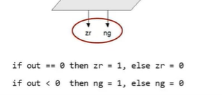

# Notes

## Last Update

2023-1-4

## Acronym

- HDL : Hardware Description Language
- ALU : Arithmetic Logic Unit

## NAND

1. NOT(x) = (x NAND x)
2. (x AND y) = NOT(x NAND y)

## HDL


```HDL

/** xor gate: out = (a And Not(b)) or Not(a) and b))*/

CHIP Xor{
  IN a, b;
  OUT out;

  PARTS:
    Not (in=a, out=nota);
    Not (in=b, out=notb);
    And (a=a, b=notb, out=aAndNotb);
    And (a=nota, b=b, out=notaAndb);
    Or (a=aAndNotb, b=notaAndb, out=out);
}

```

- HDL is functional/declarative language
- The order of HDL, statements is insignificant
- Before using a chip part, you must know its interfae. For example:
  - Not(in=, out=)
  - And(a=, b=, out=)
  - Or(a=, b=, out=)

### Multi-Bit Buses

```HDL
/*
 * Adds two 16-bit values.
 */
CHIP Add16{
  IN a[16], b[16];
  OUT out[16];

  PARTS:
   ...
}
```

```HDL
/*
 * Adds three 16-bit values
 */

CHIP Add3Way16{
  IN first[16], second[16], third[16];
  OUT out[16];

  PARTS:
    Add16(a=first, b=second, out=temp);
    Add16(a=temp, b=third, out=out);
}
```

```HDL
/*
 * ANDs together all 4 bits of the input.
 */
CHIP And4Way{
  IN a[4];
  OUT out;

  PARTS:
    AND(a=a[0], b=a[1], out=t01);
    AND(a=t01, b=a[2], out=t012);
    AND(a=t012, b=a[3], out=out);
}
```

```HDL
/*
 * Computes a bit-wise and of its two 4-bit 
 * input buses
 */
CHIP And4{
  IN a[4], b[4];
  OUT out[4];

  PARTS:
    AND(a=a[0], b=b[0], out=out[0]);
    AND(a=a[1], b=b[1], out=out[1]);
    AND(a=a[2], b=b[2], out=out[2]);
    AND(a=a[3], b=b[3], out=out[3]);
}
```

#### Sub-buses

```HDL
...
IN lsb[8], msb[8], ...
...
Add16(a[0..7]=lsb, a[8..15]=msb, b=..., out=...);
Add16(..., out[0..3]=t1, out[4..15]=t2);
```

## ALU




## RAM


## Bookmark

[Project 3](https://www.coursera.org/learn/build-a-computer/home/week/3)
