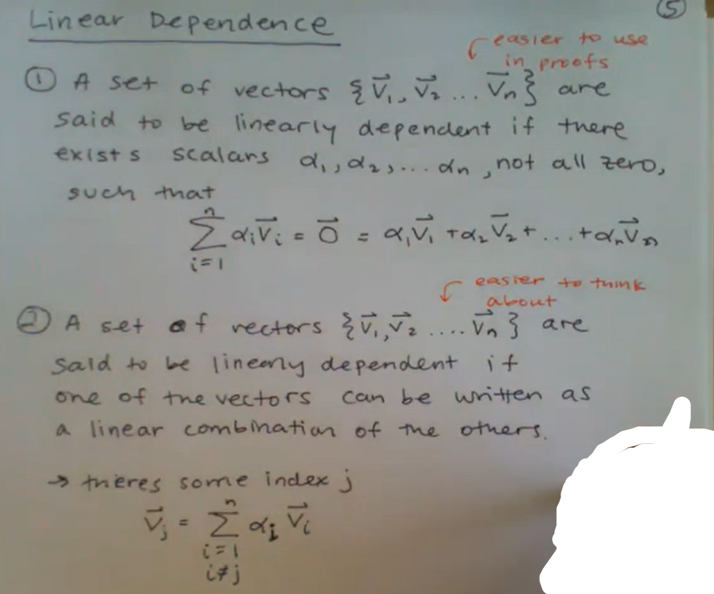
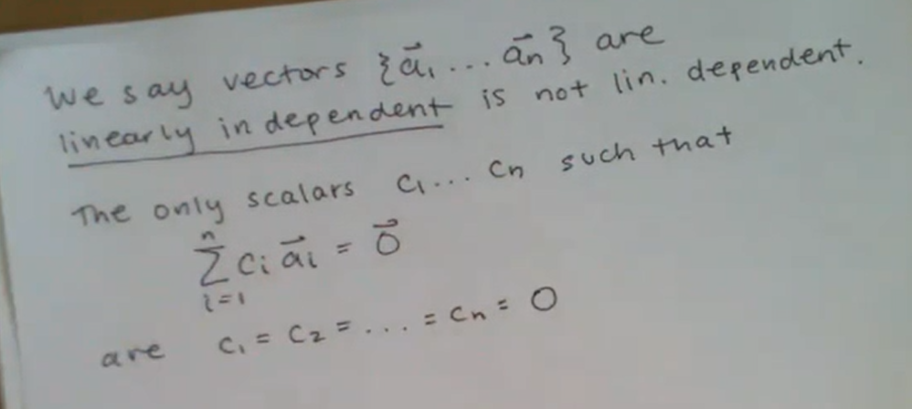

# Notes

## Last update

2023-1-11

## Design of Information Devices and System

Sense ==> Process ==> Actuate

- Best when hardware and software work together
  - Best algorithms and best code written by understanding the sensing and compute mechanisms
  - Best devices designed understanding the physical limitations

## System of linear Equations

$$
f(\alpha x_1,\alpha x_2, ......, \alpha x_n) = \alpha f(x_1, x_2, ......, x_n)
$$

$$
f(x_1+y_1, x_2 + y_2, ......, x_n+y_n) = f(x_1, x_2, ......, x_n) + f(y_1, y_2, ......, y_n )
$$

To check for linearity, check for superposition (additivity) and homogeneity (multiplicative
scaling):

$$
f(\alpha x_1 + \beta y_1 , \alpha x_2 + \beta y_2) = \alpha f(x_1 + x_2) + \beta f(y_1+y_2) \quad \forall \alpha,\beta,x_1,x_2,y_1,y_2 \in R
$$

### Does $A\vec{x} = \vec{b}$ have a solution?

Can we express $\vec{b}$ as a linear combition of the colums of A?

> If the columns of A are linearly dependent then $A\vec{x} = \vec{b}$ does not have a unique solution.

### $A\vec{x} = \vec{0}$

- if unique solution => linearly independent
- if inf solution => linearly dependent
- if no solution => never happen beacuse $\vec{x} = \vec{0}$ is always a solution.

## Bookmark

> need to finish lecture 4&5 related homework

[homework](https://inst.eecs.berkeley.edu/~ee16a/su20/#sims)

[Lecture 6](https://www.bilibili.com/video/BV1wi4y1u7gx/?from=search&seid=6787186405448657855)
