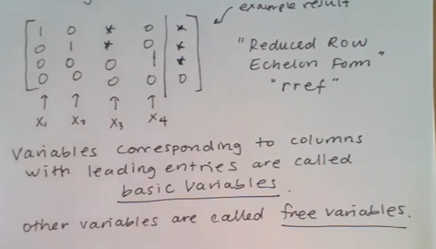
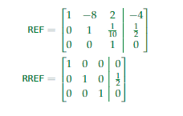

# Notes

## Last update

2023-1-3

## Design of Information Devices and System

Sense ==> Process ==> Actuate

- Best when hardware and software work together
  - Best algorithms and best code written by understanding the sensing and compute mechanisms
  - Best devices designed understanding the physical limitations

## System of linear Equations

$$
f(\alpha x_1,\alpha x_2, ......, \alpha x_n) = \alpha f(x_1, x_2, ......, x_n)
$$

$$
f(x_1+y_1, x_2 + y_2, ......, x_n+y_n) = f(x_1, x_2, ......, x_n) + f(y_1, y_2, ......, y_n )
$$

To check for linearity, check for superposition (additivity) and homogeneity (multiplicative
scaling):

$$
f(\alpha x_1 + \beta y_1 , \alpha x_2 + \beta y_2) = \alpha f(x_1 + x_2) + \beta f(y_1+y_2) \quad \forall \alpha,\beta,x_1,x_2,y_1,y_2 \in R
$$

## Bookmark

[Lecture 4](https://www.bilibili.com/video/BV1wi4y1u7gx/?from=search&seid=6787186405448657855)