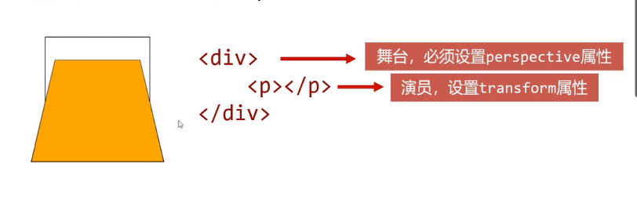

# 2D与3D

## 斜切变形

将transform属性的值设为skew(),即可实现斜切变形

```css
transform: skew(10deg, 20deg);
          /* x斜切角度，y斜切角度*/
```

## 旋转变形

- 将transform属性的值设为rotate(),即可实现旋转变形

```css
transform: rotate(45deg);
/* 旋转角度 */
```

- 若角度为正，则顺时针方向旋转，否则逆时针方向旋转

## transform-origin属性

- 可以使用transform-origin属性设置自己的自定义变换原点

## 缩放变形

- 将transform属性设置为scale(), 即可实现缩放变形

```css
transform: scale(3);
/* 旋转角度 */
```

- 当数值小于1，表示缩小元素；大于1表示放大元素

## 位移变形

- 将transform属性的值设置为translate()，即可实现位移变形

```css
transform: translate(100px, 200px);
                  /* 向右移动 向下移动 */
```

- 和相对定位非常像，位移变相也会“老家留坑”， “形影分离”

## 3D旋转

- 将transform属性的值设置为rotateX()或者rotateY(), 即可实现绕横轴、纵轴旋转

### perspective属性

- perspective属性用来定义透视轻度，可以理解为“人眼到舞台的距离”，单位是px



## 空间移动

- 当元素进行3D旋转后，即可继续添加translateX()、translateY()、translateZ()属性让元素在空间进行移动
- 一定记住，空间移动要添加在3D旋转之后

```css
transform: rotateX(30deg) translateX(30px) translateY(100px)
```
