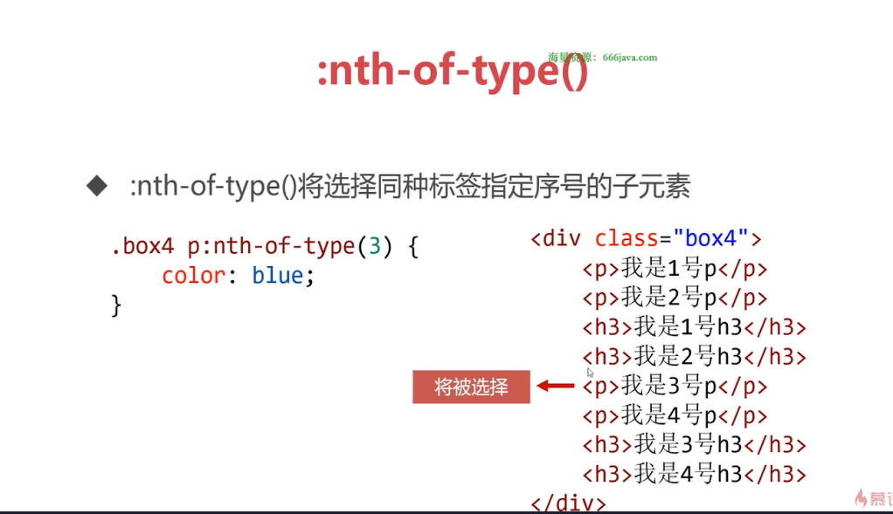

# CSS3

> CSS - cascading style sheet 层叠式样式表，是用来给HTML标签**添加样式**的语言

---


- CSS使样式和结构分离，样式和结构不用“杂糅着写”，而是彼此分开：HTML就负责结构，CSS负责样式

- HTML和CSS怎么结合呢？“选择器”就是两者的纽带。

## CSS本质

CSS就是样式“清单”，要书写合适的选择器，然后把指定元素的言好事“一条一条罗列”出来。

- CSS没有加减乘除、与或非、循环、选择、判断，**CSS不是“编程”，就是简单直接的罗列样式**

- **背诵CSS属性是非常重要的**，属性北宋熟练程度决定了做网页的速度。

## 标签选择器

标签选择器“覆盖面”非常大，所以通常用于**标签的初始化**。

```css
ul{
  /*去掉无序列表的小圆点*/
  list-style: none;
}

a{
  /*去掉超级链接的下划线*/
  text-decoration: none;
}
```

## id选择器

- 标签可以有id属性，是这个标签的唯一标识

```html
<p id="para1">我是一个段落<p>
```

- id的名称只能由**字母、数字、下划线、短横**构成，且不能以数字开头，字母区分大小写，但习惯上一般为小写字母。

- CSS选择器可以使用**井号#前缀**，选择指定id的标签。

```css
#para1{
  color: red;
}
```

## class选择器

类的优先级取决于在CSS文件中的上下关系，在上面的优先级高

### 原子类

在做网页项目前，可以将所有的常用字号、文字颜色、行高、外边距、内边距等设置为单独的类

```css
.fs12{
  font-size: 12px;
}

.fs14{
  font-size: 14px;
}

.fs16{
  font-size: 16px;
}
```

```css
.color-red{
  color: red;
}
.color-blue{
  color: blue;
}
.color-green{
  color: green;
}
```

- HTML标签就可以“则需选择”它的类名了，这样就可以非常快速的添加一些常见样式

## 选择器

选择器名称|示例|示例的意义
---------|----|--------
后代选择器|.box .spec|选择类名为box的标签内部的类名为spec的标签
交集选择器|li.spec|选择既是li标签，也属于spec类的标签
并集选择器|ul, ol|选择所有ul和ol标签

### 后代选择器

- CSS选择器中，使用空格表示“后代”

- “后代”并不一定是儿子

- 后代选择器可以有很多空格，隔开好几代

> 选择器可以任意搭配、结合，从而形成复合选择器，我们必须要能一目了然的看出选择器代表的含义。

## 伪类

>伪类是添加到选择器的描述性词语，指定要选择的元素的特殊状态，超级链接拥有4个特殊状态。

伪类|意义
-|-
a:link|没有被访问的超级链接
a:visited|已经被访问过的超级链接
a:hover|正被鼠标悬停的超级链接
a:active|正被激活的超级链接（按下按键但是还没有松开按键）

### 爱恨准则

- a标签的伪类书写，要按照“爱恨准则”的顺序，否则会有伪类不生效

**L**O**V**E **HA**TE

:link -> :visited -> :hover -> :active

## 元素关系选择器

名称|举例|意义
-|-|-
子选择器|div>p|div的子标签p
相邻兄弟选择器|img+p|图片后面紧跟着的段落将被选中
通用兄弟选择器|p~span|p元素之后所有同层级span元素


## 序号选择器

举例|意义
-|-
:first-child|第一个子元素
:last-child|最后一个子元素
:nth-child(3)|第3个子元素
:nth-of-type(3)|第三个某类子元素
:nth-last-child(3)|倒数第三个子元素
:nth-last-of-type(3)|倒数第三个某类型子元素




## 属性选择器


## CSS3新增伪类

伪类|意义
-|-
:empty|选择空标签, 所谓空就是没有内容
:focus|选择当前获得焦点的表单元素
:enabled|选择当前有效的表单元素
:disabled|选择当前无效的表单元素
:checked|选择当前已经勾选的单选按钮或者复选框
:root|选择根元素，即\<html>标签

## 伪元素

伪元素用双冒号表示

### ::before和::after

- ::before创建一个伪元素，其将称为匹配选中的元素的第一个子元素，必须设置content属性表示其中的内容

```css
a::before{
  content: "⭐"
}
```


- ::after创建一个伪元素，其将称为匹配选中的元素的最后一个子元素，必须设置content属性表示其中的内容

### ::selection

- ::selection  CSS伪元素应用于文档中被用户高亮的部分（使用鼠标圈选的部分）

### ::first-letter 和 ::first-line

- ::first-letter会选中某元素中（必须是块级元素）第一行的第一个字母

- ::first-line会选中某元素中（必须是块级元素）第一行全部文字

## 层叠性

> 多个选择器可以同时作用于同一个标签，效果叠加

### 冲突处理

> 如果多个选择器定义的属性有冲突，CSS有严密的处理冲突的规则。
>
> id权重 > class权重 > 标签权重

### 复杂选择器权重的计算

> 复杂选择器可以通过（id的个数，class的个数， 标签的个数）的形式，计算权重


#### !important提升权重

- 如果我们需要将某个选择器的某条属性提升权重，可以在属性后面写!important

```css
.spec{
  color: blue !important;
}
```

- 很多公司不允许使用!important，因为这会带来不经意的样式冲突
