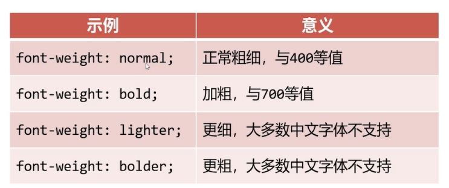

# 文本与字体属性

## 常用文本样式属性

- color 设置文本内容的前景色

- font-size 属性用来设置字号，单位通常为px。
  - 网页文字正文字号通常是16px, 浏览器最小支持10px字号

- font-weight属性设置字体的粗细程度，通常就用normal和bold两个值。

- font-style 设置字体的倾斜
  - normal 取消倾斜，比如可以把天生倾斜的i、em等标签设置为不倾斜
  - italic 设置为倾斜字体（常用）
  - oblique 设置为倾斜字体（用常规字体模拟，不常用）

- text-decoration属性用于设置文本的修实线外观的（下划线、删除线）
  - none 没有修饰线
  - underline 下划线
  - line-through 删除线

## 字体属性

- font-family 用于设置字体
  - 可以是列表形式，一般英语字体放到前面，后面的字体是前面的字体的“后备”字体。
  - 字体名称中有空格，必须用引号包裹
  - 字体通常必须是用户计算机已经安装好的字体，所以一般来说设置为微软雅黑和宋体较多，设置成其他字体较少
