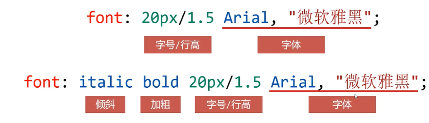

# 段落和行

- text-indent
  - 定义首行文本内容之前的缩进量
  - 缩进两个字符写作
    - text-indent: 2em
    - em表示字符宽度

- line-height
  - 用于定义行高
  - 
  - 属性的单位可以是以px为单位的数值
    - line-height: 30px
  - 也可以是没有单位的数值，表示字号的倍数
    - line-height: 1.5
  - 也可以是百分数，表示字号的倍数
    - line-height: 150%

  - 

- font合写属性
  -可以用来作为font-style，font-weight，font-size, line-height和font-familt属性的合写

  - 
  