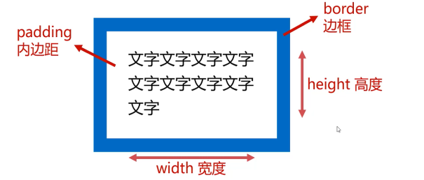

# 盒模型

## 什么是盒模型

- 所有HTML标签都可以看成矩形盒子，由width、height、padding、border构成，称为“盒模型”



```txt
width、height不是盒子总宽高
```

盒子的总宽度 = width + 左右padding + 左右border

盒子的总高度 = height + 上下padding + 上下border

## width属性

- width属性表示盒子内容的宽度
- width属性的单位通常是px, 移动端开发也会涉及百分数、rem等单位
- 当块级元素（div、h系列、li等）没有设置width属性时，它将自动撑满，但这并不意味这width可以继承

## height属性

- height属性表示盒子内容的宽度
- height属性的单位通常是px, 移动端开发也会涉及百分数、rem等单位
- 盒子的height属性如果不设置，它将自动被其内容撑开，如果没有内容，则height默认是0

## padding属性

- padding是盒子的内边距，即盒子边框内壁到文字的距离

- padiing是四个方向的，可以分别用小属性进行设置

小属性|意义
-|-
padding-top|上padding
padding-right|右padding
padding-bottom|下padding
padding-left|左padding

- padding属性如果用四个数值以空格隔开进行设置，分别表示上、右、下、左的padding

```css
padding: 10px 20px 30px 40px;
          上   右   下    左
```

- padding属性如果用三个数值以空格隔开进行设置，分别表示上、左右、下的padding

```css
padding: 10px 20px 30px;
          上  左右  下
```

- padding属性如果用二个数值以空格隔开进行设置，分别表示上下、左右、的padding

```css
padding: 10px 20px;
         上下  左右 
```

## margin属性

- margin是盒子的外边距，即盒子和其他盒子之间的距离

- margin也有四个方向

小属性|意义
-|-
margin-top|上margin, “向上踹”
margin-right|右margin, “向右踹”
margin-bottom|下margin, “向下踹”
margin-left|左margin, “向左踹”

### margin的塌陷

- 竖直方向的margin有塌陷现象：小的margin会塌陷到达的margin中，从而margin不叠加，只以大值为准


### 一些元素有默认的margin

- 一些元素（比如body、ul、p等）都有默认的margin，在开始制作网页的时候，要将它们清除

```css
/*统配符有效率问题*/
*{
  margin: 0;
  padding: 0;
}
/*应该使用并集选择器*/
body, ul, p{
  margin: 0;
  padding: 0;
}
```

### 盒子的水平居中


## 盒模型计算


## box-sizing属性

- 将盒子添加了box-sizing: border-box之后，盒子的width、height数字就表示盒子实际占有的宽高（不含margin）了，即padding、border变为“内缩”的，不再“外扩”。

- box-sizing属性大量应用于移动网页制作中，因为它结合百分比布局、弹性布局等非常好用，在PC页面开发中使用较少

## display属性

### 行内元素和块级元素


### 行内块

img和表单元素是特殊的行内块，它们既能设置宽度高度，也能够并排显示

### 行内元素和块级元素的相互转换

- display:block; 即可将元素转化为块级元素
- display:inline; 即可将元素转化为行内元素，将元素转为行内元素的应用不多见
- display:inline-block; 即将元素转为行内块

### 元素的隐藏

- display:none; 可以将元素隐藏，**元素将彻底放弃位置，如同没有写它的标签一样**
- visibility: hidden; 也可以将元素隐藏，**但是元素不放弃自己的位置**
