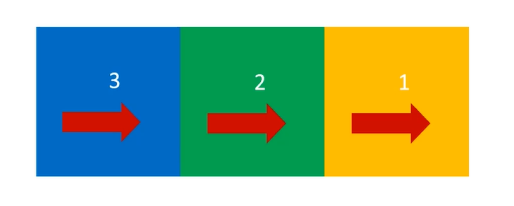

# 浮动与定位

## 浮动的基本概念

- 浮动的最本质功能：**用来实现并排**

```css
  float: left;
```

- 浮动使用要点：要浮动，并排的盒子都要设置浮动
- 父盒子要有足够的宽度，否则子盒子会掉下去
- 浮动的顺序贴靠特性
  - 子盒子会按顺序进行贴靠，如果没有足够空间，则会寻找再前一个兄弟要素
- 浮动的元素一定能设置宽高
  - 浮动的元素不再区分块级元素、行内元素，已经脱离了标准文档流，一律能够设置宽度和高度，即使它是span或者a标签等
- 右浮动
  - float: right; 即可设置右浮动
  - 

## 使用浮动实现网页布局

注意事项：

- 垂直显示的盒子，不要设置浮动，只有并排显示的盒子才要显示浮动！
- “大盒子带着小盒子跑”，一个大盒子中，又是一个小天地，内部可以继续使用浮动
- 超时售卖的塑料袋0.3元一个，div是免费的！不要节约盒子！

## BFC规范

> BFC（Box Formatting Context, 块级格式化上下文）是页面上的一个隔离的独立容器，容器里面的子元素不会影响到外面的元素，反之亦然。

### 从一个现象开始说起

- 一个盒子不设置height，当内容子元素都浮动时，无法撑起自身
- 这个盒子没有形成BFC

### 如何创建BFC

- 方法1：float的值不是none
- 方法2：position的值不是static或者relative
- 方法3：display的值时inline-block、flex或者inline-flex
- 方法4：overflow: hidden;

### 什么时overflow:hidden

- overflow:hidden; 表示溢出隐藏，溢出盒子边框的内容将会隐藏
- overflow:hidden; 是非常好用的让盒子形成BFC的方法

### BFC的其他作用

- BFC可以取消盒子的margin塌陷
- BFC可以阻止元素被浮动元素覆盖
