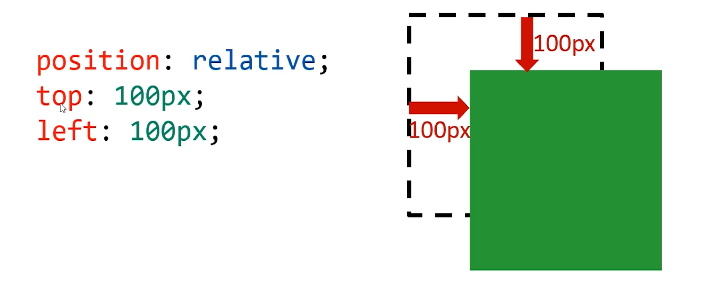
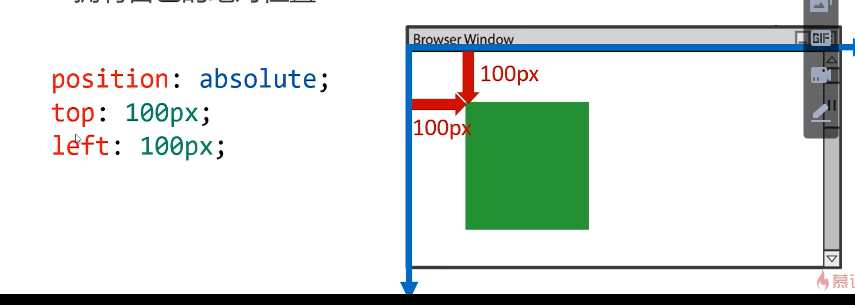
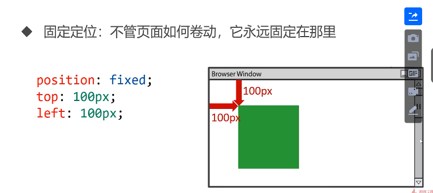

# 定位

## 相对定位

盒子可以**相对自己原来的位置**进行位置调整，称为相对定位



### 位置描述词

- left向右移动；right向左移动；top向下移动；bottom向上易懂
- 值可以为负数，即往规定方向相反移动

### 相对定位的性质

相对定位的元素，会在“老家留坑”，本质上仍然是在原来的位置，只不过渲染在新的地方而已。渲染的图形可以比喻成“影子”，不会对页面其他元素产生任何影响

### 相对位置的用途

- 相对定位用来微调元素
- 相对定位的元素，可以当作绝对定位的参考盒子

## 绝对定位

盒子可以在浏览器中以坐标进行位置精准描述，拥有自己的绝对位置



### 位置描述词

- left向右移动；right向左移动；top向下移动；bottom向上易懂

### 绝对定位脱离标准文档流

绝对定位的元素脱离标准文档流，将释放自己的位置，对其他元素不会产生任何干扰，而是对它们进行压盖

脱离标准文档流的方法：

- 浮动
- 绝对定位
- 固定定位

### 绝对定位的参考盒子

- 绝对定位的盒子并不是永远以浏览器作为基准点
- 绝对定位的盒子会以自己祖先元素中，离自己最近的拥有定位属性的盒子，当作基准点。这个盒子通常是相对定位的，所以这个性质也叫做“子绝父相”。

### 绝对定位的盒子垂直居中

绝对定位和盒子垂直居中是一个非常实用的技术

```css
position: absolute;
top: 50%;
margin-top: -自己高度的一半
```

### 堆叠顺序z-index属性

z-index属性是一个没有单位的正整数，数值大的能够压住数值小的

### 绝对定位的用途

- 绝对定位用来制作“压盖”、“遮罩”效果
- 绝对定位用来结合CSS精灵使用
- 绝对定位可以结合JS实现动画

## 固定定位



### 固定定位注意事项

- 固定定位只能以页面为参考点，没有子固父相这个性质
- 固定定位脱离标准文档流

### 固定定位用途

- 返回顶层
- 楼层导航

