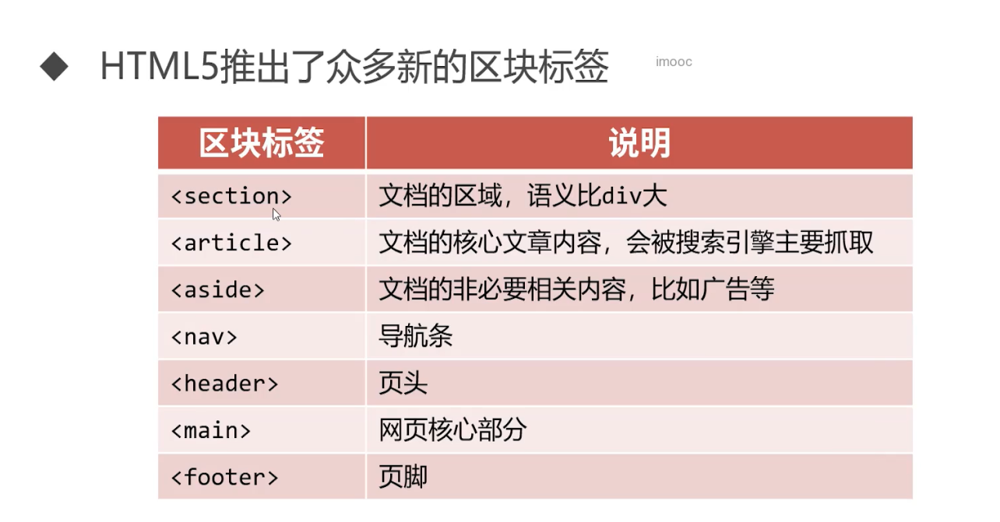
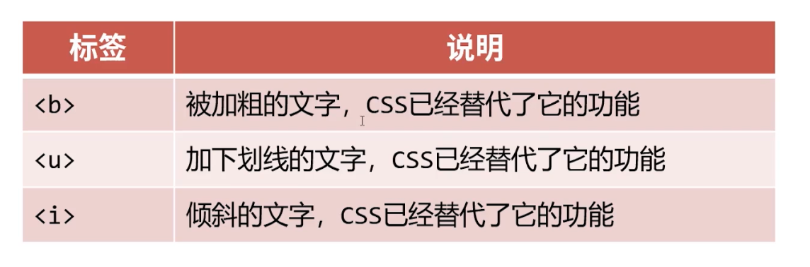
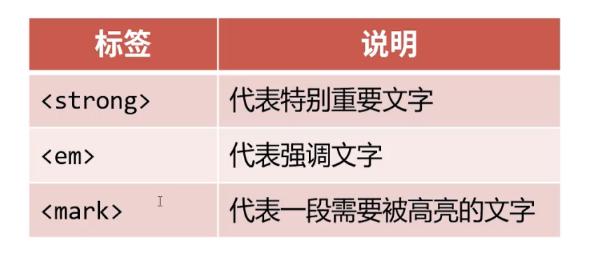

# HTML 标签

## h系列标签表示”标题“语义，h是headline的意思

|标签|语义|
|:----:|:----:|
|h1|一级标题|
|h2|二级标题|
|h3|三级标题|
|h4|四级标题|
|h5|五级标题|
|h6|六级标题|

```txt
搜索引擎非常看重<h1></h1>标签的内容，应该将重点内容放到<h1></h1>中，比如网页的logo等。
```

```txt
<h1><h1>标签一般只能放置一个，否则会被搜索引擎视为作弊
```

## 段落标签

```txt
<p></p>标签标识段落标签，p是英语paragraph的意思

任何段落都要放到<p></p>标签中，因为HTML中即使代码换行了，页面显示兄啊过也不会换行，必须写到<p></p>中。

<p></p>标签中不能嵌套hx系列和其他p标签。

```

## 网页关键词和页面描述

- 合理设置网页的关键词和页面描述，也是SEO的重要手段

- SEO(Search Engine Optimization, 搜索引擎优化)利用搜索引擎的规则提高网站在有关搜索引擎内的自然排名，让网站在搜索引擎的结果中占据领先地位，获得品牌利益。

- 使用meta标签设置网页关键词和描述，name属性费城关键，用来设施meta的具体功能。

```html
<meta name="Keyworkds" content="前端，Python, 大数据">
<meta name="Description" content="xxxxxxxxxx">
```


## 更改网页的字符集

```html
<meta charset="UTF-8">
```

## 文档类型声明DTD

- HTML文件第一行必须是DTD（Docuent Type Definition, 文档类型声明）

- 不写DTD会引发浏览器的一些兼容问题

## HTML5 区块标签



## 语义标签

```txt
<span>标签
<span>标签是文本中的“区块”标签，本身没有任何特殊的显示效果，可以结合CSS来丰富样式。
```

```txt
<b>、<u>、<i>标签
<b>、<u>、<i>标签充满了浓浓的“样式”意味，已经被CSS替代，但是在网页中也可以表示需要强调的文本。
```



```txt
<strong>、<em>、<mark>标签
strong>、<em>、<mark>标签均表示强调语义
```



```txt
<figure>、<figcaption>标签
<figure>元素代表一段独立的内容，与说明<figcaption>配合使用，它是一个独立的引用单元，比如建议读者扩展视野的图片等，当这部分转移到附录中或者其他页面时不会影响到主体。
```

```html
<p>北京是一个美丽的城市</p>
<p>
  <figure>
    
    <figcaption>北京鸟操<figcaption>
  </figure>
  <figure>
    
    <figcaption>颐和园十七孔桥<figcaption>
  </figure>
</p>

```