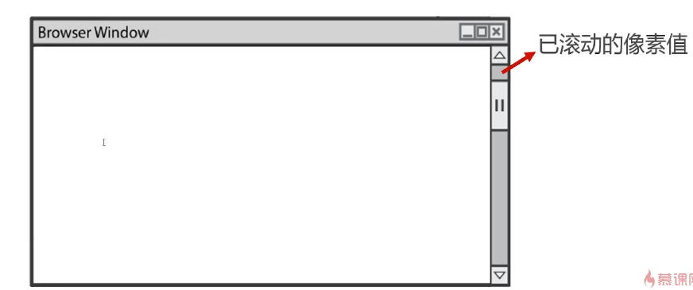

# BOM

## BOM是什么

- BOM(Browser Object Model, 浏览器对象模型)是JS与浏览器窗口交互的接口
- 一类与浏览器改变尺寸、滚动特效相关的特效，都要借助BOM技术

## window对象

- window对象是当前JS脚本运行所处的窗口，而这个窗口中包含DOM结构，window.document属性就是document对象

### 全局变量是window对象的属性

- 全局变量会成为window对象属性

```js
var a = 10;
console.log(window.a == a); //true
```

- 这就意味着，**多个js文件之间是共享全局作用域的**，即js文件没有作用于隔离功能

### 内置函数普遍是window的方法

- 如setInterval()、alert()等内置函数，普遍是window的方法

```js
console.log(window.alert == alert); //true
console.log(windoe.setInterval == setInterval); //true
```

### 窗口尺寸相关属性

属性|意义
-|-
innerHeight|浏览器窗口的内容区域的高度，包含垂直滚动条（如果有的话）
innerWidth|浏览器窗口的内容区域的宽度，包含水平滚动条（如果有的话）
outerHeight|浏览器窗口的外部高度
outerWidth|浏览器窗口的外部宽度

```txt
获得不包含滚动条的窗口宽度，要用
document.documentElement.clientWidth
```

### resize事件

- 在窗口大小改变之后，就会触发resize时间，可以使用window.onresize或者window.addEvebtListener('resize)来绑定事件处理函数

### 已卷动高度

- window.scrollY书香表示在垂直方向已滚动的像素值



### 已动高度

- document.documentElement.scrollTop属性也表示窗口卷动高度

```js
let scrollTop = window.scrollY || document,documentElement.scrollTop;
```

- document.docuemntElement.scrollTop不是只读的，而window.scrollY是只读的

### scroll事件

- 在窗口呗卷动之后，就会触发scroll事件，可以使用window.onscroll或者wondow.addEventListener("scroll")来绑定事件处理函数

## Navigator对象

- window.navigator属性可以检索navigator对象，它内部还有用户此次活动的**浏览器的相关属性和标识**

属性|意义
-|-
appName|浏览器官方名称
appVersion|浏览器版本
userAgent|浏览器的用户代理（含有内核信息和封装壳信息）
platform|用户操作系统

## History对象

- window.history对象提供了操作浏览器会话历史的接口
- 常用操作就是模拟浏览器回退按钮

```js
history.back(); //等同于点击浏览器的回退按钮
history.go(-1); //等同于history.back()
```

## Location对象

- window.location标识当前所在网址，可以**通过给这个属性赋值命令浏览器进行页面跳转**

```js
window.location = 'http://www.immoc.com';
window.location.href = 'htto://www.imooc/com';
```

### 重新加载当前页面

- 可以调用location的reload方法重新记载当前页面，参数true表示强制从服务器强制加载

```js
window.location.reloac(true);
```

### GET请求查询参数

- window.location.search属性即为当前浏览器的GET请求参数
- 比如网址https://www.immoc.com/?a=1&b=2

```js
console.log(window.location.search)
```

## BOM特效开发

### 返回顶部按钮制作

- 返回顶部的原理：改变document.documentElement.scrollTop属性，通过定时器逐步改变此值，则将用动画形式返回顶部

[demo](./%E8%BF%94%E5%9B%9E%E9%A1%B6%E9%83%A8.html)

### 楼层导航效果

- DOM元素都有offsetTop属性，表示此元素到**定位**祖先元素的垂直距离
- 定位祖先元素：在祖先中，离自己最近的且拥有定位属性的元素

