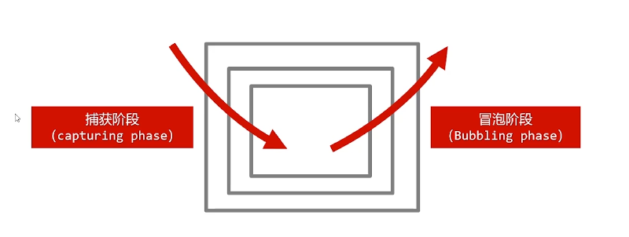
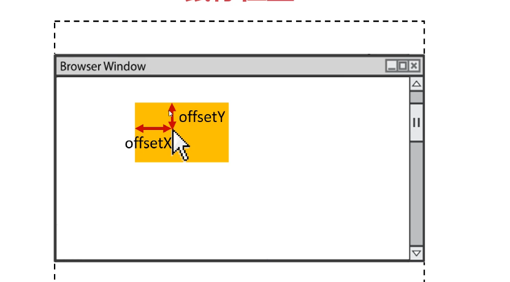
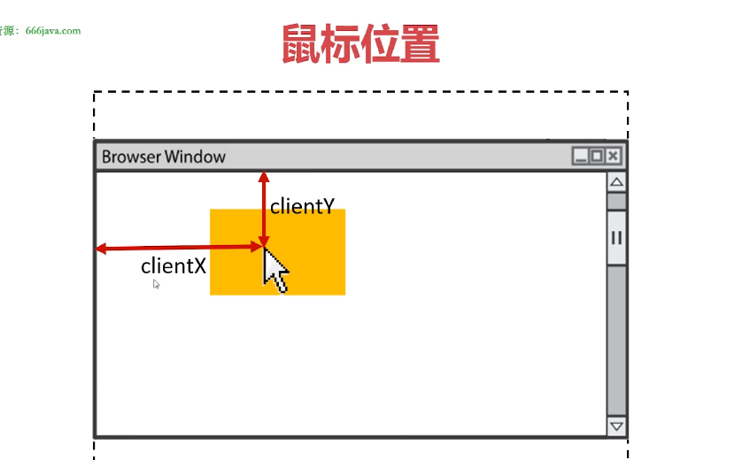
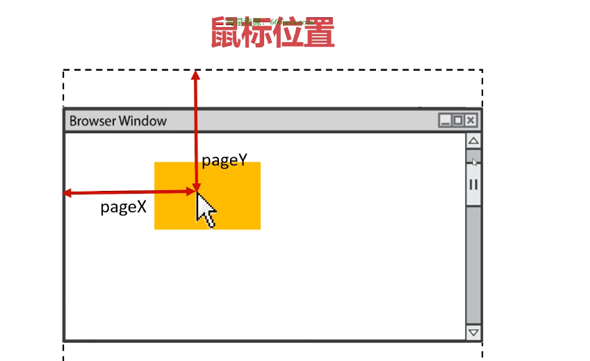
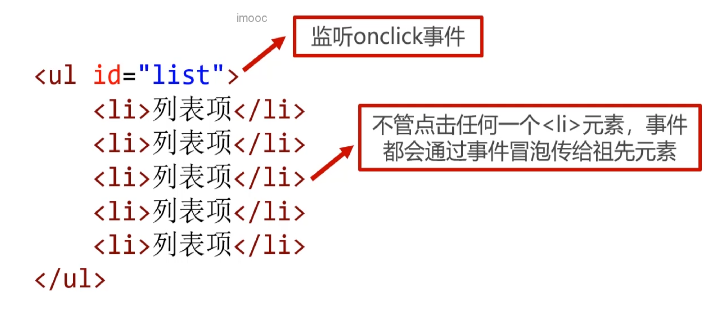

# 时间监听

## 什么是事件监听

- DOM 允许我们书写JavScript代码以让HTML**元素对事件作出反应**
- 什么是“事件”：用户与网页的交互动作
  - 当用户点击元素时
  - 当鼠标移动到元素上时
  - 当文本框的内容被改变时
  - 当键盘在文本框中被按下时
  - 当网页已加载完毕时
  - .....
- “监听”，顾名思义，就是让计算机**随时能够发现这个事件发生了**，从而执行程序员预先编写的一些程序
- 设置时间监听的方法主要有**onxxx和addEventListener()两种**

```js
  oBox.onclick = function(){
    //点击盒子时，将执行这里的语句
  }
```

## 常见的鼠标事件监听

事件名|事件描述
-|-
onclick|当鼠标单击某个对象
ondblclick|当鼠标双击某个对象
onmousedown|当某个鼠标按键在某个对象上被按下
onmouseup|当某个鼠标按键在某个对象上被松开
onmousemove|当某个鼠标按键在某个对象上被移动
onmouseenter|当鼠标进入某个对象（相似事件onmouseover）
onmouseleave|当鼠标离开某个对象（相似事件onmouseout）

## 常见的键盘事件监听

事件名|事件描述
-|-
onkeypress|当某个键盘的键被按下（系统按钮如箭头键和功能键无法得到识别）
onkeydown|当某个键盘的键被按下（系统按钮可以识别，并且会先于onkeypress发生）
onkeyup|当某个键盘的键被松开

## 常见的表单事件监听

事件名|事件描述
-|-
onchange|当用户改变域的内容
onfocus|都能够某元素获得焦点（比如tab键或鼠标点击）
onblur|当某元素失去焦点
onsubmit|当表单被提交
onreset|当表单被重置

## 常见的页面事件监听

事件名|事件描述
-|-
onload|当页面或图像被完成加载
onunload|当用户退出页面

## 研究： 当盒子嵌套时事件监听的执行顺序

## 事件的传播

- 实际上，事件的传播是：先从外到内，然后再从内到外


### onxxx写法是能监听冒泡阶段

### addEventListner()方法

- DOM0级事件监听：只能监听冒泡阶段

```js
oBox.onclick = function(){

}
```

- DOM2级事件监听：

```js
//事件名不加on
oBox.addEventListener('click', function(){
  //这是事件处理函数
}， true);
//true监听捕获阶段
//false监听冒泡阶段
```

### 注意事项

- 最内部元素不再区分捕获和冒泡阶段，会执行写在前面的监听，然后执行后写的监听
- 如果给元素设置相同的两个或多个同名事件，则DOM0级写法后面写的会覆盖先写的；而DOM2级会顺序执行

## 事件对象

- 事件处理函数提供一个形式参数，它是一个对象，封装了本次事件的细节

- 这个参数通常用单词event或字母e来表示

```js
oBox.onmousemove = function(e){
  //对象e就是这次事件的“事件对象”
}
```

### 鼠标位置

属性|属性描述
-|-
clientX|鼠标指针相对于**浏览器**的水平坐标
clientY|鼠标指针相对于**浏览器**的垂直坐标
pageX|鼠标指针相对于**整张网页**的水平坐标
pageY|鼠标指针相对于**整张网页**的垂直坐标
offsetX|鼠标指针相对于**事件源元素**的水平坐标
offsetY|鼠标指针相对于**事件源元素**的垂直坐标





### e.charCode属性和e.keyCode属性

- e.charCode属性通常用于onkeypress事件中，表示用户输入的字符的“字符码”
- e.keyCode属性通常用于onkeydown事件和onkeyup中，表示用户按下的按键的“键码”

#### charCode字符码

字符|字符码
-|-
数字0~数字9|48~57
大写字母A~Z|65~90
小写字母a~z|97~122

#### keyCode键码

按键|键码
-|-
数字0~数字9|48~57（同charCode键码完全相同）
字母不区分大小写a~z|65~90
四个方向键← ↑ → ↓|37、38、39、40
回车键|13
空格键|32

### e.preventDefault()方法

- e.preventDefault()方法用来阻止时间产生的“默认动作”
- 一些特殊的业务要求，需要阻止事件的“默认动作”

[小案例1](./%E5%B0%8F%E6%A1%88%E4%BE%8B-preventDefault()%E6%96%B9%E6%B3%95.html)

[小案例2](./%E5%B0%8F%E6%A1%88%E4%BE%8B-%E6%8C%87%E9%92%88%E9%BC%A0%E6%A0%87%E6%BB%9A%E8%BD%AE%E4%BA%8B%E4%BB%B6.html)

### e.stopPropagation()方法

- e.stopPropagation()方法用来**阻止事件继续传播**
- **在一些场合，非常有必要切断事件继续传播**，否则会造成页面特效显示出bug

[Demo](./stopPropagation.html)

[小案例-制作一个弹出层：点击按钮显示弹出层，点击网页任意地方，弹出层关闭](./%E5%B0%8F%E6%A1%88%E4%BE%8B-%E5%88%B6%E4%BD%9C%E4%B8%80%E4%B8%AA%E5%BC%B9%E5%87%BA%E5%B1%82.html
)

## 事件委托

### 批量添加事件监听

- 题目：页面上有一个无序列标\<ul>，它内部共有20个\<li>元素，请批量给他们添加点击事件监听，实现效果：点击哪个\<li>，哪个\<li>元素就变红。

[Demo](./%E6%89%B9%E9%87%8F%E6%B7%BB%E5%8A%A0%E4%BA%8B%E4%BB%B6%E7%9B%91%E5%90%AC.html)

### 批量添加事件监听的性能问题

- 每一个事件监听注册都会消耗一定的系统内存，而批量添加事件会导致监听数量太多，内存消耗非常大

- 实际上，每个\<li>的时间处理函数都是不同的函数，这些函数本身也会占用内存

### 新增元素动态绑定事件

- 题目：页面上有一个无序列表\<ul>，它内部没有\<li>元素，晴制作一个按钮，点击这个按钮就能增加一个\<li>元素。并且要求每个增加的\<li>元素也要有点击事件监听，实现效果点击哪个\<li>，哪个\<li>元素就变红。

[Demo](./%E6%96%B0%E5%A2%9E%E5%85%83%E7%B4%A0%E5%8A%A8%E6%80%81%E7%BB%91%E5%AE%9A%E4%BA%8B%E4%BB%B6.html)

### 动态绑定事件的问题

- 新增元素必须分别添加事件监听，不能自动获得事件监听
- 大量事件监听、大量事件处理函数都会产生大量消耗内存

### 什么是事件委托

- 利用事件冒泡机制，将后代元素事件委托给祖先元素


### e.target和e.currentTarget属性

- 事件委托通常需要结合使用e.target属性

属性|属性描述
-|-
target|触发此事件的最早元素，即“事件源元素”
currentTarget|事件处理程序附加的元素

### 事件委托的使用场景

- **当有大量类似元素需要批量添加事件监听时**，使用事件委托可以减少内存开销
- 当有动态元素节点上树时，使用事件委托可以让新上树的元素具有事件监听

### 使用事件委托时需要注意的事项

- onmouseenter和onmouseover都表示“鼠标进入”，它们有什么区别呢？
  - 答：onmouseenter不冒泡，onmouseover冒泡
  
- 使用事件委托时要注意：不能委托不冒泡的事件给祖先元素
- 最内层元素不能再有额外的内层元素了，比如：

```html
<ul id="list">
  <li><span>我是span</span>列表项</li>
  <li><span>我是span</span>列表项</li>
  <li><span>我是span</span>列表项</li>
</ul>
```

## 定时器

- setInterval()函数可以重复调用一个函数，在每次调用之间具有固定的时间间隔

```js
setInterval(function(){
  //这个函数将自动被以固定间隔时间调用
}，2000)；
```

### 函数的参数

- setInterval()函数可以接收第3、4......个参数，它们将按顺序传入函数

```js
setInterval(function(a, b){
  //形式参数a的值是88，形式参数b的值是66
}, 2000, 88, 66)
```

### 具名函数也可以传入setInterval

- 具名函数也可以传入setInterval

```js
let a = 0;
function fun(){
  console.log(++a);
}

setInterval(fun, 1000);
```

### 清除定时器

- clearInterval()函数可以清除一个定时器

```js
//设置定时器，并且用timer变量接收这个定时器
let timer = setInterval(function(){}, 2000);
//点击按钮时，清除定时器
oBtn.onclick = function(){
  clearInterval(timer);
}
```

>为了防止定时器叠加，我们应该在设置定时器之前先清除定时器

## 延时器

- setTimeout()函数可以设置一个延时器，当指定时间到了之后，会执行函数一次，不再重复执行

```js
setTimeout(function(){
  //这个函数会在2秒后执行一次
}, 2000);
```

### 清除延时器

- clearTimeout()函数可以清楚延时器，和clearInterval()非常类似

## 初步认识异步语句

- setInterval()和setTimeout()是两个异步语句

- 异步（asynchronous）不会阻塞CPU继续执行其他语句，当异步完成时，会执行“回调函数”（callback）

## 使用定时器实现动画

- 动画是网页上非常常见的业务需求
- 使用定时器可以实现动画，利用的就是“视觉暂留”原理
- 使用定时器实现动画较为不便：
  1. 不方便根据动画总时间计算步长
  2. 运动方向要设置正负
  3. 多种运动进行叠加较为困难（比如一个方形一边移动一边变为圆形）

[demo](./%E4%BD%BF%E7%94%A8%E5%AE%9A%E6%97%B6%E5%99%A8%E5%AE%9E%E7%8E%B0%E5%8A%A8%E7%94%BB.html)

## JS和CSS3结合实现动画

- 我们世道， CSS3的transition过渡属性可以实现动画
- JavaScript可以利用CSS3的transition属性轻松实现元素动画
- JS和CSS3结合实现动画规避了定时器制作动画的缺点

### 函数节流

- 函数节流： 一个函数执行一次后，只有大于设定的执行周期后才允许指定第二次
- 函数节流非常容易实现，只需要借助setTimeout()延时器

```js
let lock = true;
function 需要节流的函数(){
  //如果锁时关闭状态，则不执行
  if(!lock)return

  //关锁
  lock = false;
  
  //指定毫秒数后将锁打开
  setTimeout(function(){
    lock = true;
  }, 2000);
}
```

[Demo](./JS%E5%92%8CCSS3%E7%BB%93%E5%90%88%E5%AE%9E%E7%8E%B0%E5%8A%A8%E7%94%BB.html)

[动画效果开发1-无缝连续滚动特效](./%E6%97%A0%E7%BC%9D%E8%BF%9E%E7%BB%AD%E6%BB%9A%E5%8A%A8%E7%89%B9%E6%95%88.html)

[动画效果开发2-轮播图特效-跑马灯](./%E8%BD%AE%E6%92%AD%E5%9B%BE%E7%89%B9%E6%95%88_%E8%B7%91%E9%A9%AC%E7%81%AF.html)

[动画效果开发2-轮播图特效-呼吸灯](./%E8%BD%AE%E6%92%AD%E5%9B%BE%E7%89%B9%E6%95%88_%E5%91%BC%E5%90%B8%E7%81%AF.html)
