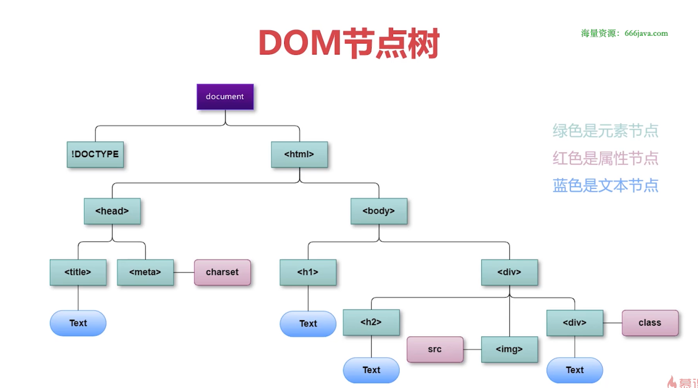
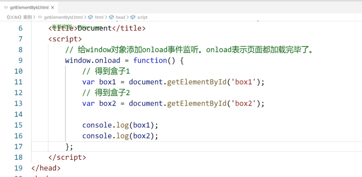
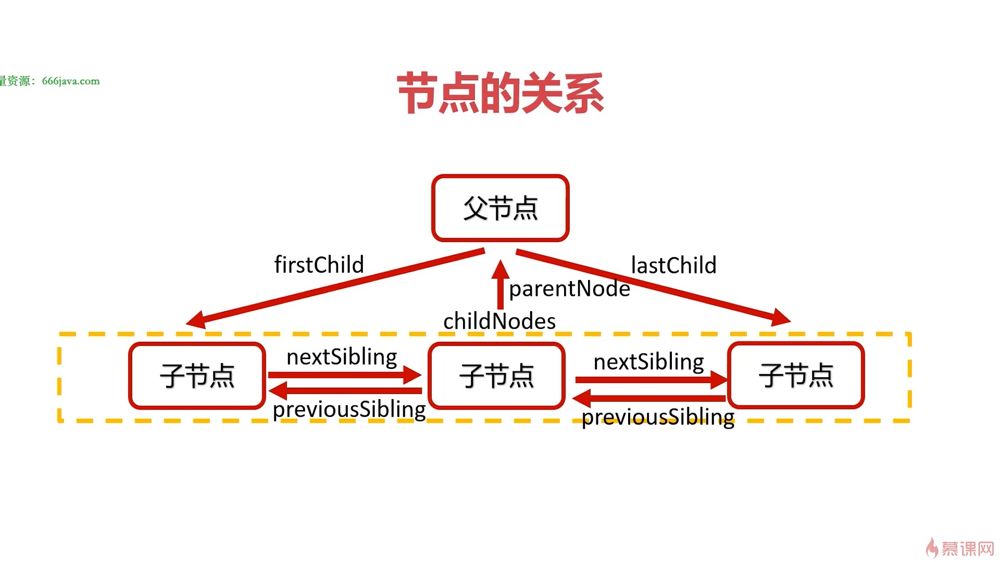
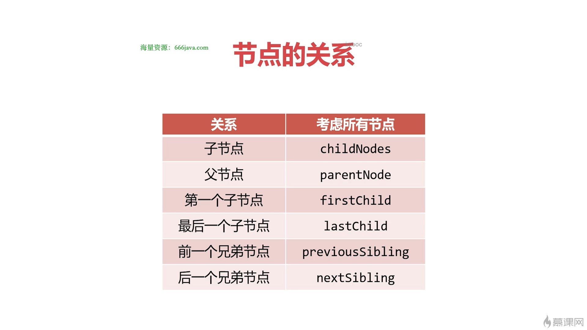
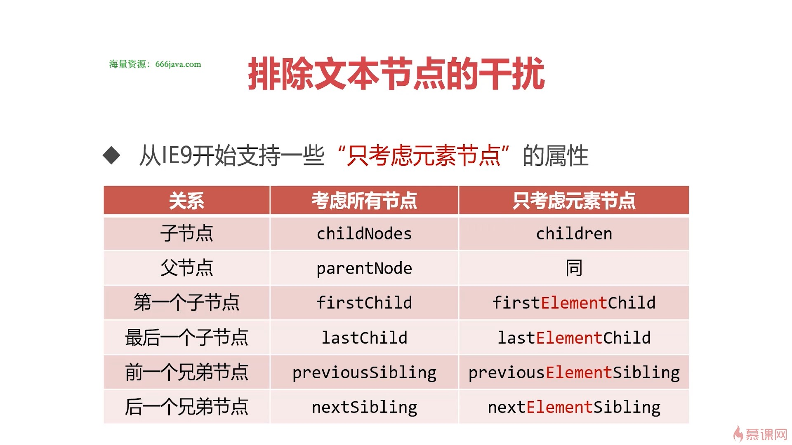

# DOM

## DOM的基本概念

- DOM是JS操控HTML和CSS的桥梁
- DOM（Document Object Model，文档对象模型）是JavaScript操作HTML文档的接口，是文档操作变得非常优雅、简便。
- DOM最大的特点就是将文档表示为节点数。



## 节点操作

### 如何改变元素节点中的内容

- 改变元素节点中的内容可以使用两个相关属性：
  - innerHTML
  - innerText
- innerHTML属性能以HTML语法设置节点中的内容
- innerText属性只能以纯文本的形式设置节点中的内容

### 节点的创建

- document.createElement() 方法用于创建一个指定tagname的HTML元素

```js
let oDiv = document.createElement('div');
```

#### 孤儿节点

- 新创建出来的节点时“孤儿节点”，这意味着它并没有被挂载到DOM树上，我们无法看见它
- 必须继续使用appendChild()或insertBefore()方法将孤儿节点插入到DOM树上

#### appendChild()

- 任何已经在DOM树上的节点，都可以调用appendChild()方法，它可以将孤儿节点挂载到它的内部，成为它的最后一个子节点

```js
父节点.appendChild(孤儿节点);
```

#### insertBefore()

- 任何已经在DOM树上的节点，都可以调用insertBefore()方法，它可以将孤儿节点挂载到它的内部，成为它的“标杆子节点”之前的节点

```js
父节点.insertBefore(孤儿节点，标杆节点)
```

### 移动节点

- 如果将已经挂载到DOM树上的节点成为appendChild()或者insertBefore()的参数，这个节点将会被移动

```js
新父节点.appendChild(已经有父亲的节点);
新父节点.insertBefore(已经有父亲的节点，标杆子节点);
```

- 这意味着一个节点不能同时位于DOM树的两个位置

### 删除原点

- removeChild()方法从DOM中删除一个子节点

```js
父节点.removeChild(要删除子节点);
```

- 节点不能主动删除自己，必须由父节点删除它

### 克隆节点

- cloneNode()方法可以克隆节点，克隆出的节点是“孤儿节点”

```js
let 孤儿节点 = 老节点.cloneNode();
let 孤儿节点 = 老节点.cloneNode(true);
```

- 参数是一个布尔值，表示是否采用深度克隆：
  - 如果为true，则该节点的所有后代节点也都会被克隆
  - 如果为false,则只克隆该节点本身

## 如何改变元素节点的CSS样式

- 改变元素节点的CSS样式需要使用这样的语句

```js
oBox.style.backgroundColor = 'red';
oBox.style.backgroundImage = 'url(images/1.jpg)';
oBox.style.fontSize = '32px';
```

## 如何改变元素节点的HTML属性

- 标准W3C属性，如src、href等等，只需要直接打点进行更改即可

```js
oImg.src = 'images/2.jpg';
```

- 不符合W3C标准的属性，要使用setAttribute()和getAttribute()来设置、读取

```js
oBox.setAttribute('data-n', 10);
var n = oBox.getAttribute('data-n');
alert(n)
```

## nodeType常用属性值

- 节点nodeType属性可以显示这个节点具体的类型

nodeType值|节点类型
-|-
1|元素节点，例如\<p>和\<div>
3|文子节点
8|注释节点
9|document节点
10|DTD节点

## 访问元素节点

- 所谓“访问”元素节点，就是指“得到”、“获取”页面上的元素节点
- 对节点进行操作，第一步就是要得到它
- 访问元素节点主要依靠document对象

### 认识document对象

- document对象是DOM中最重要的东西，几乎所有DOM的功能都封装在了document对象中
- document对象也表示整个HTML文档，它是DOM节点树的根
- document对象的nodeType属性值是9

### 访问元素节点的常用方法

方法|功能
-|-
document.getElementById()|通过id得到元素
document.getElementsByTagName()|通过标签名得到元素数组
document.getElementsByClassName()|通过类名得到元素数组
document.querySelector()|通过选择器得到元素
document.querySeclecorAll()|通过选择器得到元素数组

### 延迟运行

- 在测试DOM代码时，通常JS代码一定要写到HTML节点的后面，都则JS无法找到相应HTML节点
- 可以使用window.onload = function(){}事件，使页面加载完毕后，再执行指定的代码


## 节点的关系




### 注意：文本节点也属于节点

- DOM中，文本节点也属于节点，在使用节点的关系时一定要注意

### 排除文本节点的干扰



### 书写常见的节点关系函数

- 书写IE6也能兼容的“寻找所有元素子节点”函数
- 书写IE6也能兼容的“寻找前一个元素兄弟节点”函数
- 如何编写函数，获得某元素的所有兄弟节点？
