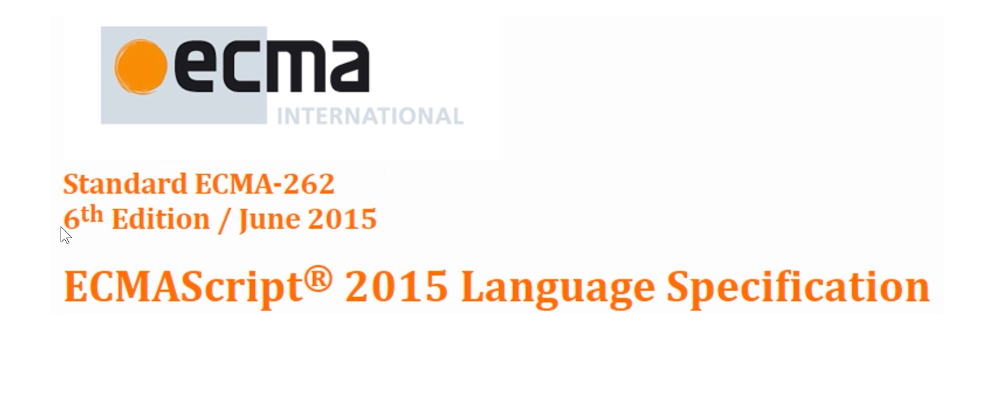

# ES6

## 基础

### ECMAScript6

- ECMAScript是语言的标准
- 6是版本号

> ES6 = ECMAScript这门语言的第6代标准

### ECMAScript

- 欧洲计算机制造商协会
- 标准化组织

> ECMAScript = 由ECMA这个标准化组织制定的一个语言标准

#### 具体是什么

- 语法
- API

#### 历史版本

ES1~3、ES5~6

- ES4被废弃了
- ES3
  - do while、switch、正则表达式
- ES5
  - forEach、map、filter、Object.create、Object.defineProperty
- ES6

#### 命名方式

- ES6 vs ES2015
  - ES6 -> ES7 -> ES8 -> ... = ES6+
  - ES2015 -> ES2016 -> ES2017 -> ...

#### ES与JavaScript的关系

- JavaScript(浏览器端) = ECMAScript(语法+API) + DOM + BOM

#### ES6的兼容性

- 主流浏览器的最新版本几乎全部支持ES6
- IE老版本等不支持的浏览器，可以用**Babel**转码

### let和const

- let和const是什么
- let和const的用法
- 什么是变量，什么是常量

### const

- 为什么需要const
  - 就是为了那些一旦初始化就不希望重新赋值的情况设计的
- const的注意事项
  - 一旦声明，就必须立即初始化，不能留到以后赋值
  - const声明的常量，允许在不重新赋值的情况下修改它的值
    - 引用数据类型
- 什么时候用const. 什么时候用let
  - 不知道用什么的时候，先用const

### let、const与var的区别

- 重复声明
  - var 允许
  - let、const不允许
- 暂时性死区
  - let、const有，var没有
  - 只要作用域内存在ley、const,它们所声明的变量或常量就自动“绑定”这个区域，不再受外部作用域的影响
- winodw对象的属性和方法（全局作用域中）
  - 全局作用域中， var声明的变量，通过function声明的函数会自动变成window对象的属性或方法
  - let、const不会
- 变量提升
  - var会提升变量到当前作用域的顶部：
    - console.log(a);
    - var a = 1;
  - let、const不存在变量提升
    - 养成良好的编程习惯，对于所有的变量或常量，做到先声明、后使用
- **块级作用域**
  - 

### let和const的应用

