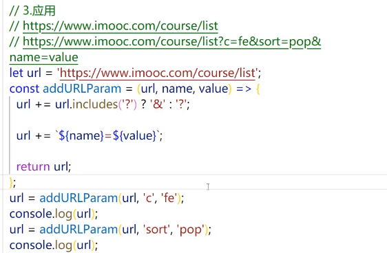

# ES6 More

## 剩余参数

[Demo](./%E5%89%A9%E4%BD%99%E5%8F%82%E6%95%B0.html)

### 注意事项

[Demo](./%E5%89%A9%E4%BD%99%E5%8F%82%E6%95%B0%E6%B3%A8%E6%84%8F%E4%BA%8B%E9%A1%B9.html)

### 应用

[Demo](./%E5%89%A9%E4%BD%99%E5%8F%82%E6%95%B0%E7%9A%84%E5%BA%94%E7%94%A8.html)

## 数组展开符

### 基本用法

```js

const arr = [1,2,3]
console.log(Math.min(...arr));

```

### 区分剩余参数和展开运算符

```js

//根本区别
//展开运算符
//[3,1,2] => 3,1,2
//剩余参数
//3,1,2=> [3,1,2]
```

### 数组展开运算符的应用

- 复制数组
- 合并数组
- 字符转转为数组
  - ...'alex'

## 对象展开运算符

[Demo](./%E5%AF%B9%E8%B1%A1%E5%B1%95%E5%BC%80%E8%BF%90%E7%AE%97%E7%AC%A6.html)

### 对象展开运算符的注意事项

- 如果展开运算符后面是字符串，它会自动转成一个类似数组的对象，因此返回的不是空对象

### 对象展开运算符的实际应用

```js

const defaultParam = {
  username: "xxx",
  age: 0,
  sex: 'male'
}

const {username, age, sex} = {...defaultParam, ...userParam};
```

## Set

```js
const s = new Set();
s.add(1);
s.add(2).add(3);

if(s.has(1)){
  s.delete(1);
}

s.clear();

s.forEach(function(value, key, set){
  //Set中的value === key
  //set就是s本身 set === s
  console.log(this);
}, document); //修改this指向

s.size;
```

### Set构造函数的参数

```js
const s = new Set("123"); //Set(3) {'1', '2', '3'}
const s1 = new Set([1,2,3]);Set(3) {1, 2, 3}
```

## Map

```js
const m = new Map();

m.set('key', 'value');

const value = m.get('key');

if(m.has('key')){
  m.delete('key');
}

m.clear();

m.forEach(function(value, key, smap){
  //set就是s本身 set === s
  console.log(this);
}, document); //修改this指向

m.size;
```

### Map构造函数的参数

```js
//数组，二维数组
const m1 = new Map([["k1",2], ["k2", 3]]);


```

## Iterator

[Demo](./Iterator%E6%98%AF%E4%BB%80%E4%B9%88.html)

- 为什么需要Iterator遍历器
  - 统一遍历方式
    - 遍历数组：for循环和forEach方法
    - 遍历对象：for in循环

- 如何更方便的使用Iterator

```js
//我们一般不会直接使用Iterator去遍历
//for .. of ..
```

### for..of

[Demo](./for_of%E7%94%A8%E6%B3%95.html)

### 原生可遍历和非原生可遍历

#### 什么是可遍历

- 只要有Symbol.iterator方法，并且这个方法可以生成可靠遍历对象，就是可遍历的
- 只要可遍历，就可以使用for...of循环来统一遍历
- 原生可遍历的有哪些
  - 数组
  - 字符串
  - Set
  - Map
  - arguments
  - NodeList
- 非原生可遍历对象
  - 一般的对象

## ES6的新增方法

[字符串includes](./STRincludes.html)


[padStart和padEnd](./padStart%E5%92%8CpadEnd.html)
[trimStart和trimEnd](./trimStart%E5%92%8CtrimEnd.html)

[数组includes](./Arrincludes.html)

[Array.from()](./ArrayFrom.html)

[find()_and_findIndex()](./find_and_findIndex.html)

[Object.assign()](./Objec_assign.html)

[Object.keys(), Object.values(), Object.entries()](./Obejct_keys_values_entries.html)
