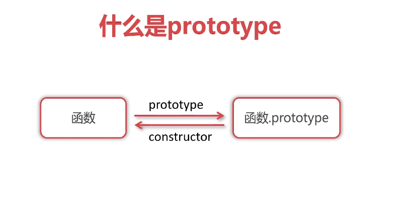
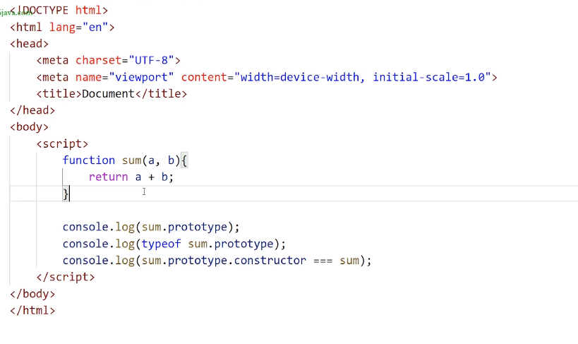
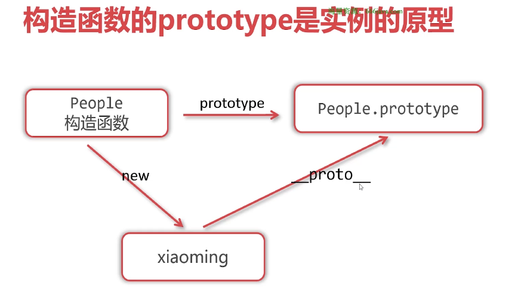
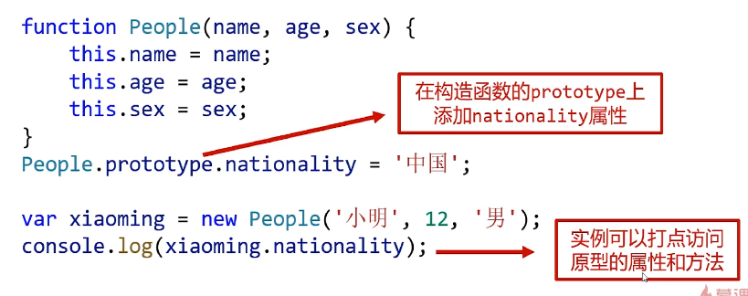
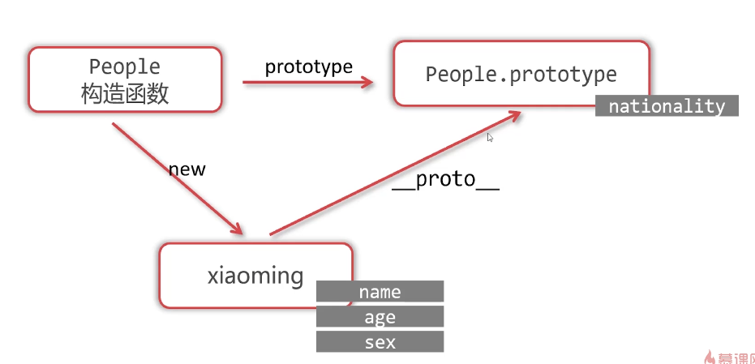
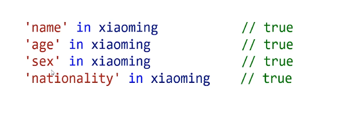
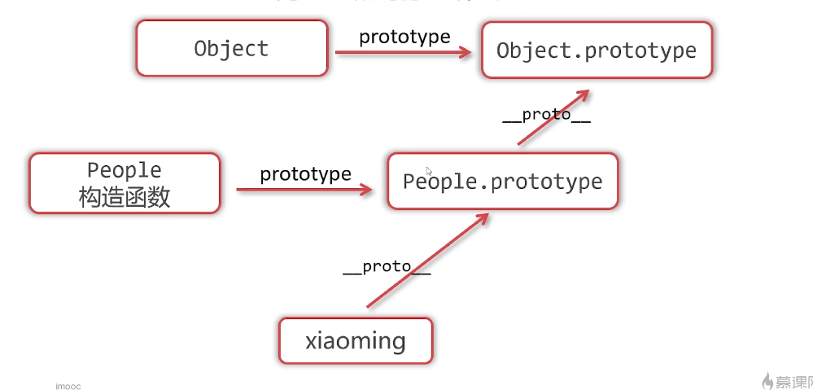
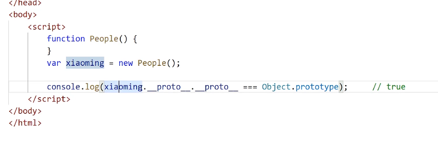
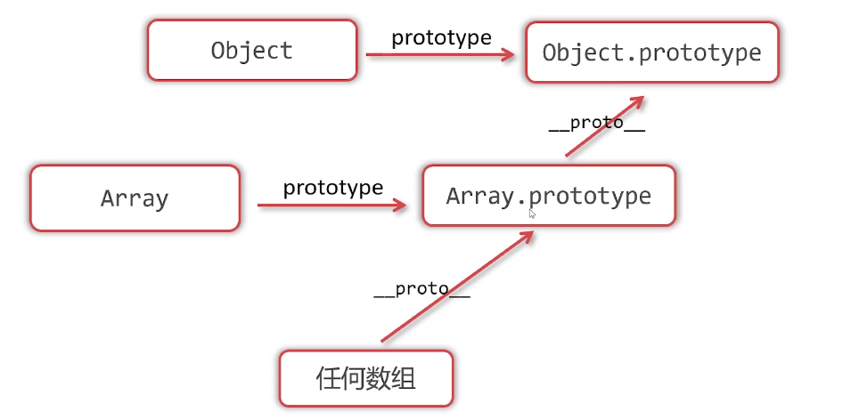

# Object Oriended

## 认识对象

- 对象（object）是“键值对”的集合，表示属性和值得映射关系。

```js
var xiaoming = {
  name: '小明',
  age: 12,
  sex: '男',
  hobbies: ['足球', '编程']
};
```

### 属性是否加引号

- 如果对象的属性键名不符合JS标识符命名规范，则这个键名必须用引号包裹
- 如果属性名不符合JS标识符命名规范，则必须用方括号的写法来访问

- 如果属性名以变量形式存储，则必须使用方括号形式

```js
var obj = {
  a: 1,
  b: 2,
  c: 3
};

var key = 'b'
consolo.log(obj[key])
```

### 属性的删除

```js
var obj = {
  a: 1,
  b: 2
};
delete obj.a;
```

### 对象的方法

- 如果某个属性值是函数，则它也被称为对象的“方法”

### 对象的遍历

- 和遍历数组类似，对象也可以被遍历，遍历对象需要使用for...in...循环
- 使用for...in...循环可以遍历对象的每个键

```js
for(let k in obj){
  console.log('属性' + k + '的值是' + obj[k]);
}
```

### 对象的深浅克隆

||举例|当var a = b变量传值时|当用==比较时|
-|-|-|-
基本类型值|数字、字符串、布尔、undefined、null|内存中产生新的副本|比较值是否相等
引用类型值|对象、数组等|内存中不产生新的副本，而是让新变量指向同一个对象|比较内存地址是否相同，即比较是否为同一对象

#### 对象的浅克隆

- 复习什么是浅克隆：只克隆对象的“表层”，如果对象的某些属性值又是引用类型值，则不进一步克隆它们，只是传递它们的引用

- 使用for...in...循环既可实现对象的浅克隆

```js
var obj1 = {
  a: 1,
  b: 2,
  c: [44,55,66]
};

var obj2 = {}
for(var k in obj1){
  //每遍历一个k属性，就给obj2也添加
  obj2[k] = obj1[k]
}
```

#### 对象的深克隆

- 复习什么是深克隆：克隆对象的全貌，不论对象的属性值是否又是引用类型值，都能将它们实现克隆

```js
var obj1 = {
  a: 1,
  b: 2,
  c: [44,55,{
    m: 55,
    n: 66,
    p: [77, 88]
  }]
};

//深克隆函数
function deepClone(o){
  //判断o是对象还是数组
  let result = null
  if(Array.isArray(o)){
    //数组
    result = [];
    for(let i = 0; i < o.length; ++i>){
      result.push(deepClone(o[i]));
    }
  }
  else if(typeof o == 'object'){
    //对象
    result = {}
    for(let k in o){
      result[k] = deepClone(o[k])
    }
  }
  else{
    result = o
  }
  return result;
}

let obj2 = deepClone(obj1);

```

## 上下文

### 函数的上下文

- 函数中可以使用this关键字，它表示函数的上下文
- 与中文中“这”类似，函数中的this具体指代什么必须通过调用函数时的“前言后语”来判断

```js
let xiaoming = {
  nickname: '小明'，
  age： 12，
  sayHello ：function(){
    console.log('我是' + this.nickname + '，我' + this.age + '岁了')；
  }
}
```

- 函数的上下文由调用方式决定
  - 同一个函数，用不同的形式调用它，则函数的上下文不同
  - case 1: 对象大点调用函数，函数中的this指代这个打点的对象
  
  ```js
  xiaoming.sayHello();
  ```

  - case 2: 圆括号直接调用，函数中的this指代window对象
  
  ```js
  let sayHello = xiaoming.sayHello;
  sayHello();
  ```

- 函数的上下文（this关键字）由调用函数的方式决定，function是“运行时上下文”策略
- 函数如果不调用，则不能确定函数的上下文

- 规则1：对象打点调用它的方法函数，则函数的上下文是这个打点的对象
  - 对象.方法()
- 规则2： 圆括号直接调用函数，则函数的上下文是window对象
  - 函数()
- 规则3： 数组（类数组对象）枚举出函数进行调用，上下文是这个数组（类数组对象）
  - 数组[下标]()

### 类数组对象

- 什么是类数组对象：所有键名为自然数序列（从0开始），且有length属性的对象
- arguments对象是最常见的类数组对象，它是函数的实参列表

```js
function fun(){
  arguments[3]();
}
fun('A', 'B', 'C', function(){
  console.log(this[1])
})
```

- 规则4： IIEF中的函数，上下文是window对象

```js
(function(){

})();
```

- 规则5：定时器、延时器调用函数，上下文是window对象
- 规则6： 时间处理函数的上下文是绑定事件的DOM元素

### call和apply

#### call和apply能指定函数的上下文

```js
function sum(){
  alert(this.chinese + this.math + this.length);
}

var xiaoming = {
  chinese: 80,
  math: 95,
  english: 93
}

sum.call(xiaoming);
sum.apply(xiaoming);
```

#### call和apply的区别

```js
function sum(b1, b2){
  alert(this.c + this.m + this.e + b1 + b2);
}

//call要用逗号罗列参数
sum.call(xiaoming, 5, 3);
//apply要把参数写到数组中
sum.apply(xiaoming, [5, 3]);
```

#### 到底使用call还是apply?

```js
function fun1(){
  fun2.apply(this, arguments);
}

function fun2(a, b){
  alert(a+b);
}

fun1(33, 44);
```

### 上下文总结

规则|上下文
-|-
对象.函数（）|对象
函数（）|window
数组[下标]（）|数组
IIFE|window
定时器|window
DOM事件处理函数|绑定DOM元素
call和apply|认识指定
用new调用函数|秘密创建出的对象

## 用new操作符调用函数

```js
new 函数();
```

- JS规定，使用new操作符调用函数会进行“四步走”：
  1. 函数体内会自动创建出一个空白对象
  2. 函数的上下文（this）会指向这个对象
  3. 函数体内的语句会执行
  4. 函数会自动返回上下文对象，及时函数没有return语句


### 四步走详解

```js
function fun(){
  this.a = 3;
  this.b = 5;
}

var obj = new fun();
console.log(obj);
```

## 类与实例

## prototype




- 普通函数来说的prototype属性没有任何用处，而构造函数的prototype属性非常有用
- 构造函数的prototype属性是它的实例的原型



### 原型链查找

- JavaScript规定：实例可以打点访问它的原型的属性和方法，这被称为“原型链查找”




### hasOwnProperty

- hasOwnProperty方法可以检查对象是否真正“自己拥有”某属性或者方法


### in

- in运算符只能检查某个属性或方法是否可以被对象访问，不能检查是否是自己的属性或方法



## 在prototype上添加方法

## 原型链的终点




### 关于数组的原型链



## 继承

### 通过原型链实现继承

## 面向对象到底是什么？

- 面向对象的本质：定义不同的类，让类的实例工作
- 面向对象的优点：程序编写更清晰、代码结构更严密、使代码更健壮更利于维护
- 面向对象经常用到的场合：需要封装和复用性的场合（组件思维）


