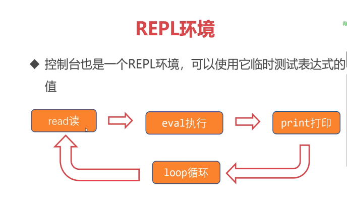
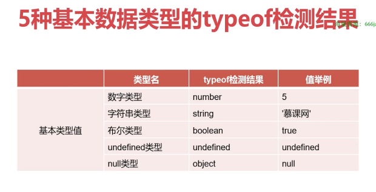

# JS

## 前端三层

||语言|功能|
|-|-|-|
结构层|HTML|搭建结构、放置部件、描述语义
样式层|CSS|美化页面、实现布局
行为层|JavaScript|实现交互效果、数据收发、表单验证等

演员/化妆师/导演

## ECMAScript是JavaScript的标准

1997年，欧洲计算机制造商协会（ECMA）设置了JavaScript的标准，命名为ECMAScript


## JavaScript的书写位置

```txt
在<body>中<script>标签，在内部书写JavaScript
```

```txt
将代码单独保存为.js格式文件，然后再HTML文件中使用<script src=""></script>的形式引入它
```

## REPL



## 数据类型

### 基本数据类型

- Number
- String
- Boolean
- Undefined
- Null

### 复杂数据类型

- Object
- Array
- Function
- RegExp
- Date
- Map
- Set
- 等等

### typeof运算符



## 闰年判断

- 能被4整除且不能被100整除
- 能被100整除也能被400整除
