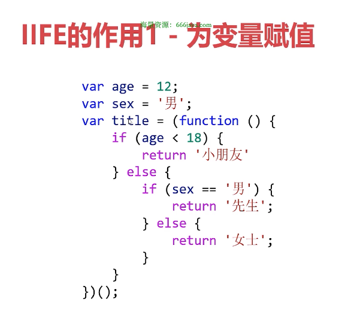

# JS

## 前端三层

||语言|功能|
|-|-|-|
结构层|HTML|搭建结构、放置部件、描述语义
样式层|CSS|美化页面、实现布局
行为层|JavaScript|实现交互效果、数据收发、表单验证等

演员/化妆师/导演

## ECMAScript是JavaScript的标准

1997年，欧洲计算机制造商协会（ECMA）设置了JavaScript的标准，命名为ECMAScript


## JavaScript的书写位置

```txt
在<body>中<script>标签，在内部书写JavaScript
```

```txt
将代码单独保存为.js格式文件，然后再HTML文件中使用<script src=""></script>的形式引入它
```

## REPL


## 数据类型

### 基本数据类型

- Number
- String
- Boolean
- Undefined
- Null

### 复杂数据类型

- Object
- Array
- Function
- RegExp
- Date
- Map
- Set
- 等等

### typeof运算符


## 闰年判断

- 能被4整除且不能被100整除
- 能被100整除也能被400整除

## 什么是闭包

- JavaScript中函数会产生闭包（closure）。闭包是函数本身和该函数声明时所处的环境状态的组合。
- 函数能够“记忆住”器定义时所处的环境，即使函数不在其定义环境中被调用，也能访问定义时所处环境的变量。

### 观察闭包现象

- 在JavaScript中，每次创建函数时都会创建闭包。
- 但是，闭包特性往往需要将函数“换一个地方”执行，才能被观察出来。

### 闭包非常实用

- 闭包很有用，因为它允许我们将数据与操作该数据的函数关联袭来。这与“面向对象编程”有少许相似之处。
- 闭包的功能：记忆住、模拟私有变量。

#### 闭包用途1 - 记忆性

- 当闭包产生时，函数所处环境的状态会始终保持在内存中，不会在外层函数调用后被自动清除。这就是闭包的记忆性。


#### 闭包用途2 - 模拟私有变量

- 题目：请定义一个变量a, 要求能保证这个a只能被进行指定操作（如加1、乘2），而不能进行其他操作，应该怎么编程呢？

- 在Java、C++等语言中，有私有属性的概念，但是JavaScript中只能用闭包来模拟


#### 使用闭包的注意点

- 不能滥用闭包，否则会造成网页的性能问题，严重时可能会导致内存泄漏。所谓内存泄漏是指程序中已动态分配的内存由于某种原因未释放或无法释放。

## 立即执行函数IIFE

### 什么是IIFE

- IIFE (Immediately Invoked Function Expression, 立即执行函数表达式) 是一种特殊的JavaScript函数写法，一旦被定义，就立即被调用。

```js
(function(){
  statements;
})()
```





