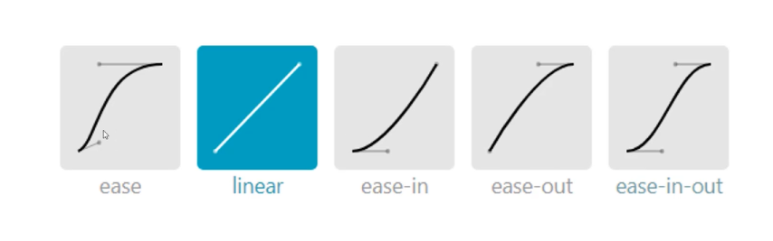
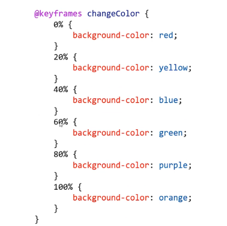

# 过渡与动画

## transition过度

- transition过度属性是CSS3浓墨重彩的特性，过度可以为一个元素在不同样式之间变化自动添加“补间动画”

### transition属性基本使用

- transition属性有4个要素

```css
transition: width 1s linear 0s;
      /*什么属性要过渡 动画时长 变化速度曲线 延迟时间*/
```

### 哪些属性可以参与过度

- 所有数值类型的属性、都可以参与过渡， 比如width、height、left、top、border-radius
- 背景颜色和文字颜色都可以被过渡
- 所有变形（包括2D和3D）都能被过渡

### all

- 如果要所有属性都参与过度，可以写all

```css
transition: all 1s linear 0s;
```

### 过渡的四个小属性

属性|意义
-|-
transition-property|哪些属性要过度
transition-duration|动画时间
transition-timing-function|动画变化曲线（缓动效果）
transition-delay|延迟时间

## 过渡缓动效果

### 缓动参数

transition的第三个参数就是缓动参数，也是变化速度曲线

```css
transition: all 1s linear 0s;
                   /* 变化速度曲线*/
```

### 常用缓动参数



### 贝塞尔曲线

-网站https://cubic-bezier.com可以生成贝塞尔曲线，可以自定义动画欢动参数

## 动画的定义和调用

- 可以收用@keyframes来定义动画，keyframes表示“关键帧”，在项目上线前，要不胜@-webkit-这样的私有前缀

```css
/*定义动画*/
@keyframes r{ /*动画名字*/
/*起始状态*/
      from{
            transform: rotate(0);
      }
/*结束状态*/
      to{
            transform: rotate(360deg);
      }
}
```

### 动画的调用

- 定义动画之后，就可以使用animation属性调用动画

```css
animation: r 1s linear 0s;
```

### 动画的执行次数

- 第五个参数就是动画的执行次数

```css
animation: r 1s linear 0s 3;
```

- 如果想永远执行可以写infinite

```css
animation: r 1s linear 0s infinite;
```

### alternate和forwards

- 如果想让动画的第2、4、6...（偶数次）自动逆向执行，那么要加上alternate参数即可

```css
animation: r 1s linear 0s infinite alternate;
```

- 如果想让动画停止在最后结束状态，那么要加上forwards

```css
animation: r 1s linear 0s forwards;
```

### 多关键帧动画

