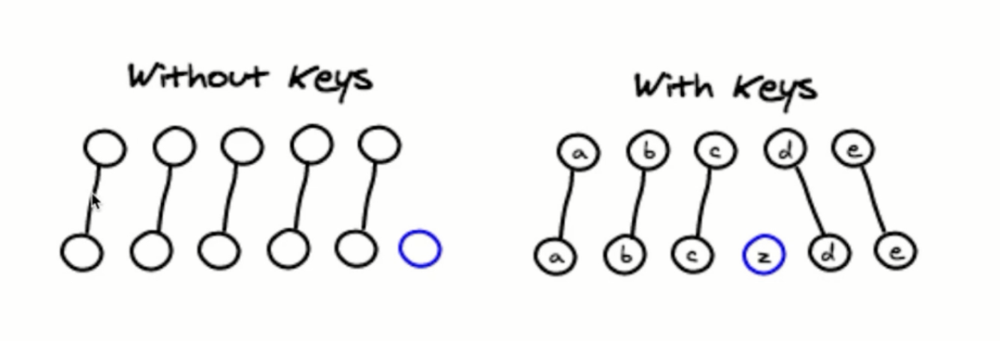

# README

## imutable

state 不允许我们做任何的改变

## 可以与其它框架并存

## 单向数据流

## 视图层框架

## 函数式编程

## props, state与render函数的关系

1. 当组件的state或者props发生改变的时候, render函数就会重新执行
2. 当父组件的render函数被运行时，它的子组件的render都将被重新运行一次

## 虚拟DOM

1. state 数据
2. JSX 模板
3. 数据 + 模板 生成虚拟DOM （虚拟DOM就是一个JS对象，用它来描述真实DOM）（损耗了性能）

    ```txt
    ['div', {id: 'abc'}, ['span', {}, 'hello world']]
    ```

4. 用虚拟DOM的结构生成真实的DOM，来显示:

    ```<div id="abc"><span>hello world</span></div>```


5. state 发生变化
6. 数据 + 模板 生成新的虚拟DOM（极大的提升了性能）

    ```txt
    ['div', {id: 'abc'}, ['span', {}, 'bye bye']]
    ```

7. 比较原始虚拟DOM和新的虚拟DOM的区别[Diff算法](#diff算法)，找到区别是span中内容（极大的提升了性能）：
8. 直接操作DOM，改变span中的内容

```txt
减少了对真实DOM的创建，减少了对真实DOM的对比，取而代之的是创建的都是JS对象，比较的也是JS对象，实现了极大的新能飞跃
```


优点：

1. 性能提升了
2. 它使得跨段应用得以实现。React Native

### Diff算法

setState是异步操作
假如连续操作三次setState，react会合并这三次操作，节省性能


同级比较，只要发现有一层不一样，其子层就不会在比较，会全部替换

- 比对算法简单，比对速度快，虽然会浪费性能




> **提升React性能的关键是保证虚拟DOM节点的key值不变**
> 所以能不用index做key值，就不要用index做key值

## React 生命周期

生命周期函数指在某一时刻组件会自动调用执行的函数


- componentWillMount: 在组件即将被挂到页面的时刻自动执行
- componentDidiMount: 组件被挂在到页面之后，自动被执行

- shouldComponentUpdate: 组件被更新之前，他会自动被执行
- componentWillUpdate: 组件被更新之前，shouldComponentUpdate之后（取决于返回的是true/false），会自动被执行
- componentDidUpdate: 组件被更新之后，会被自动执行

- componentWillReceiveProps:
    1. 当一个组件要从父组件接受参数
    2. 只要父组件的render函数被执行了，子组件的这个生命周期函数就会被执行
    3. 如果这个组件第一次存在于父组件中，不会被执行
    4. 如果这个组件之前已经存在于父组件中，才会执行

- componentWillUnmount: 当组件即将被从页面中剔除的时候，会被执行

### 使用场景

### useEffect

```js
useEffect(() => {
  // This runs after every render
});

useEffect(() => {
  // This runs only on mount (when the component appears)
}, []);

useEffect(() => {
  // This runs on mount *and also* if either a or b have changed since the last render
}, [a, b]);

useEffect(() => {
    const connection = createConnection();
    connection.connect();
    return () => {
      connection.disconnect();
    };
  }, []);
```

**In React, rendering should be a pure calculation of JSX and should not contain side effects like modifying the DOM.**

**Effects should usually synchronize your components with an external system. If there’s no external system and you only want to adjust some state based on other state, you might not need an Effect.**

#### Fetching data

```js
useEffect(() => {
  let ignore = false;

  async function startFetching() {
    const json = await fetchTodos(userId);
    if (!ignore) {
      setTodos(json);
    }
  }

  startFetching();

  return () => {
    ignore = true;
  };
}, [userId]);
```

You can’t “undo” a network request that already happened, but your cleanup function should ensure that the fetch that’s not relevant anymore does not keep affecting your application. 

#### Not an Effect: Initializing the application

Some logic should only run once when the application starts. You can put it outside your components:

```js
if (typeof window !== 'undefined') { // Check if we're running in the browser.
  checkAuthToken();
  loadDataFromLocalStorage();
}

function App() {
  // ...
}
```

```shell
npm install mockjs --save-dev
```