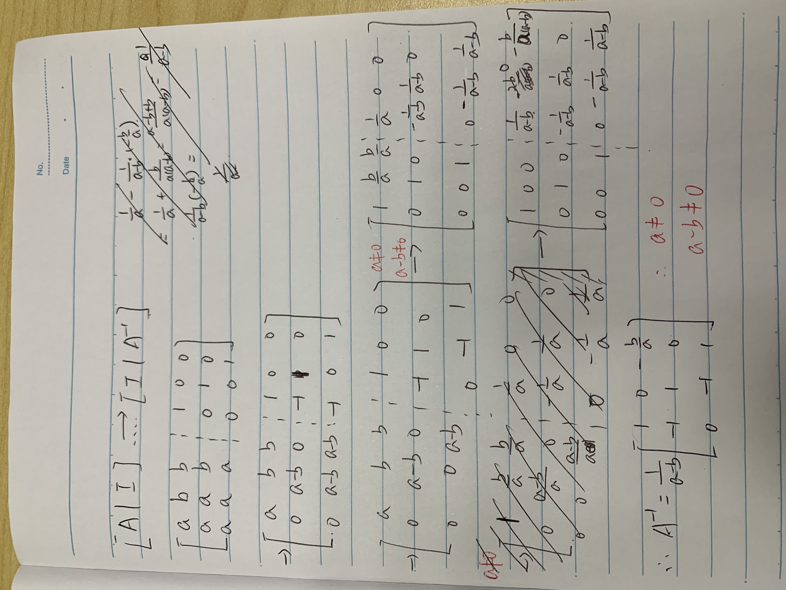
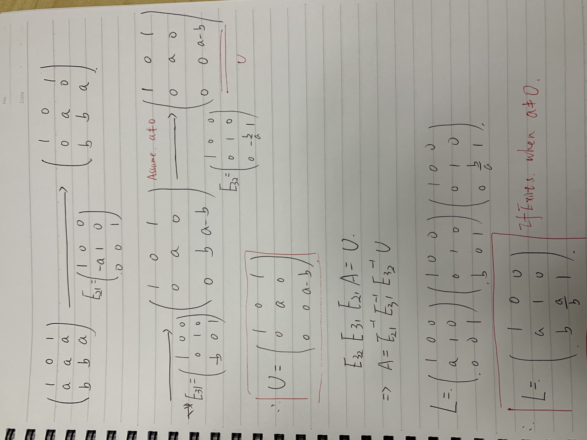
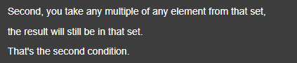
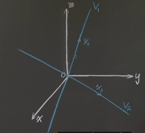
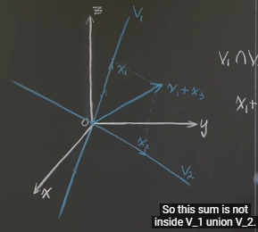
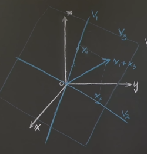
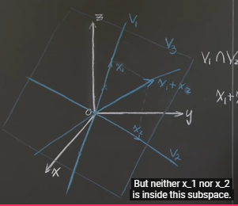
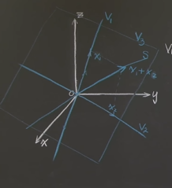

# Notes

## Last Update

2022-12-29

## Inverse Matrices

Find the conditions on <u>a</u> and <u>b</u> that make the matrix A invertible, and find $A^{-1}$ when it exists
$$
A = \begin{bmatrix}
  a&  b& b\\
  a&  a& b\\
  a&  a& a
\end{bmatrix}
$$

### Solution

## Factorization into A = LU

Find the LU-decomposition of the matrix
$$
A = \begin{bmatrix}
 1& 0& 1\\
 a& a& a\\
 b& b& a
\end{bmatrix}
$$

when it exists

For which real number a and b does it exists

### Solution

## Transposes, Permutations, Vector Spaces

### Transposes

$R^TR$ is alwasys symmetic.

$$
(R^TR)^T = R^TR
$$

### Vectors spaces

#### Subspaces of $R^2$

1. all of $R^2$
2. any line through $\begin{bmatrix}0\\0\end{bmatrix}$
3. zero vector only

#### question

$x_1=\begin{bmatrix}0\\1\\3\end{bmatrix}$,$x_2=\begin{bmatrix}2\\4\\0\end{bmatrix}$

1. Find:
    - $V_1$= subspace generated by $x_1$
    - $V_2$ = subspace generated by $x_2$

    Describe $V_1 \cap V_2$

    
    $V_1 \cap V_2 = \begin{Bmatrix}O\end{Bmatrix}$

2. Find $V_3$ = Subspace generated by {$x_1$, $x_2$}, Is $V_3$ equal to $V_1 \cup V_2$ ? Find a subspace S of $V_3$, s.t. $x_1 \notin S, x_2 \notin S$

    

    $V_3 \notin V_1 \cup V_2$

    $V_1 \cup V_2$ is two line union

    

    

3. What is $V_3 \cap \begin{Bmatrix}xy& plane\end{Bmatrix}$

   The line contains $x_2$

   $V_3 \cap \begin{Bmatrix}xy& plane\end{Bmatrix} = V_2$

   

## Column Space and Nullspace

- if $Av=0$, and $Aw=0$, then $A(v+w) = 0$, then $A(12v) = 0$,

### Vector Subspaces

which are subspaces of $R^3=\begin{Bmatrix}\beta_1 \\ \beta_2 \\ \beta_3 \end{Bmatrix}$

1. $\beta_1+\beta_2-\beta_3=0$

> Yes,
> $\begin{pmatrix}1&1&-1\end{pmatrix}\begin{pmatrix}\beta_1\\\beta_2\\\beta_3\end{pmatrix} = 0$

2. $\beta_1\beta_2-\beta_3=0$

> No

3. $\begin{Bmatrix}\beta_1\\\beta_2\\\beta_3\end{Bmatrix} = \begin{Bmatrix}1\\0\\0\end{Bmatrix}+C_1\begin{Bmatrix}1\\0\\-1\end{Bmatrix}+C_2\begin{Bmatrix}1\\0\\1\end{Bmatrix}$

> Yes

>$\begin{pmatrix}1\\0\\0\end{pmatrix}=\frac{1}{2}\begin{pmatrix}1\\0\\-1\end{pmatrix}+\frac{1}{2}\begin{pmatrix}1\\0\\1\end{pmatrix}$

>$\begin{Bmatrix}\beta_1\\\beta_2\\\beta_3\end{Bmatrix}=(C_1+\frac{1}{2})\begin{Bmatrix}1\\0\\-1\end{Bmatrix}+C_2+(\frac{1}{2})\begin{Bmatrix}1\\0\\1\end{Bmatrix}$

4. $\begin{Bmatrix}\beta_1\\\beta_2\\\beta_3\end{Bmatrix} = \begin{Bmatrix}0\\1\\0\end{Bmatrix}+C_1\begin{Bmatrix}1\\0\\-1\end{Bmatrix}+C_2\begin{Bmatrix}1\\0\\1\end{Bmatrix}$

> can we find

> \begin{Bmatrix}0\\1\\0\end{Bmatrix}+C_1\begin{Bmatrix}1\\0\\-1\end{Bmatrix}+C_2\begin{Bmatrix}1\\0\\1\end{Bmatrix} = 0$

> No

## Bookmark

[Solving Ax = 0: Pivot Variables, Special Solutions](https://ocw.mit.edu/courses/18-06sc-linear-algebra-fall-2011/pages/ax-b-and-the-four-subspaces/solving-ax-0-pivot-variables-special-solutions/)