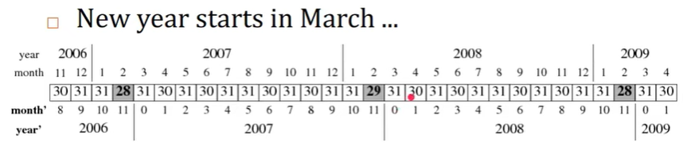
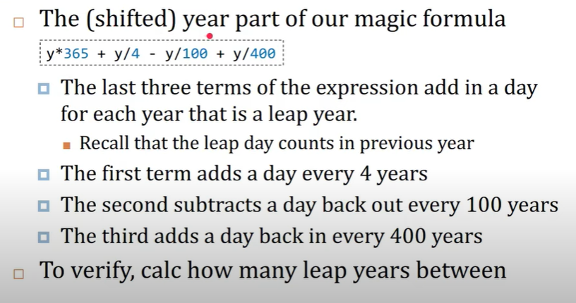
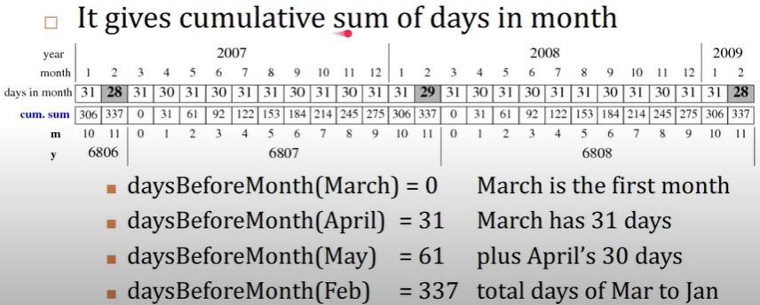
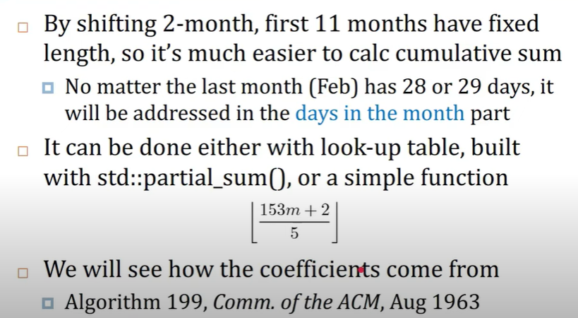

# Notes

**四年一闰， 百年不闰，四百年又闰**

```python

def isLeapYear(year):
  return year%4 == 0 and (year%100 != 0 or year%400 == 0)
```

## Attempts Converting Dates to Ints

- Day number of (*year*, *month*, *day*) is sum of
  - Days before Jan 1 of the *year*, def daysYear() as
    - daysYear(year+1) = daysYear(year) + 365 + isLeap(year)
    - daysYear(2004) = daysYear(2003) + 365
    - daysYear(2005) = daysYear(2004) + 366
  - Days in this year before 1st of this *month*
    - daysMonth(1) = 0, daysMonth(2) = 31,
    - daysMonth(3) = 28 or 29, daysMonth(4) = 31, ...
  - Days in this month, ie. *day*

## Julian Day Number 儒略日

```python
def toJulianDayNumber(year, month, day):
  ADJ = (14-month)/12
  Y = year + 4800 - adj
  M = month + 12*ADJ -3
  return day + (153*M + 2)/5 + Y*365 + Y/4 - Y/100 + Y/400 - 32045
```

- Given a date(year, month, day), Julian Day Number is sum of
  - Days before year: y*365 + y/4 - y/100 + y/400
  - Days before the month : (153*m + 2)/5
  - Days in the month : day
  - 32045: An offset make day 0 is Nov24, 4714 BC



- March is month 0 in shifted year
- February is the last month (no.11) of shifted year
- Leap day (if any) will be the last day of previous year

**Length of first 11 month (m=0,10) are fix now**
31, 30, 31, 30, 31, 31, 30, 31, 30, 31, 31

- First three lines of toJulianDayNumber

```python
  ADJ = (14 - month)/12  #ADJ = (month < 3) ? 1 : 0 
  Y = year + 4800 - adj
  M = month + 12*ADJ -3
```

- month = [1, 2, 3, 4, 5, 6, 7, 8, 9, 10, 11, 12]
$$
Y = \begin{cases}
  & year + 4800 \ month \ge 3 \\
  & year + 4799 \ month \lt 3
\end{cases}
$$

$$
M = \begin{cases}
  & month - 3 \ month \ge 3 \\
  & month + 9 \ month \lt 3
\end{cases}
$$

- After shifting, much easier to calculate
  - Days before the year, esp. days before the month



- The most magic part in the formula is about M

```txt
  daysBeforeMonth(m) = (153*m+2)/5
```




## A function from YYYY-MM-DD to Julian Day Number

```python
def toJulianDayNumber(year, month, day):
  ADJ = (14-month)//12
  Y = year + 4800 - ADJ
  M = month + 12*ADJ -3
  return day + (153*M + 2)//5 + Y*365 + Y//4 - Y//100 + Y//400 - 32045
```

## Inverse function of to JulianDayNumber()

```python
def toYearMonthDay(int julianDayNumber):
  a = julianDayNumber + 32044
  b = (4*a + 3) //146097
  c = a - ((b*146097)//4)
  d = (4*c+3)//1461
  e = c - 1461*d//4
  m = (5*e + 2) // 153
  year = b*100 + d - 4800 + m // 10
  month = m + 3 - 12 * (m//10)
  day = e - ((153*m+2)//5) + 1

  return year, month, day
```
