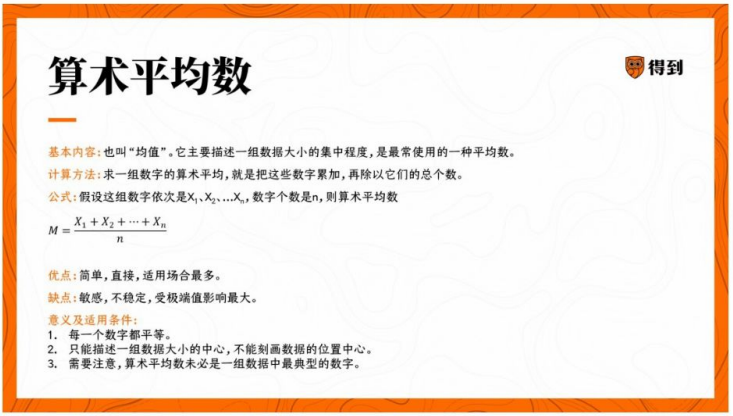
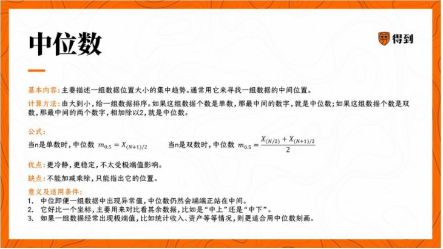
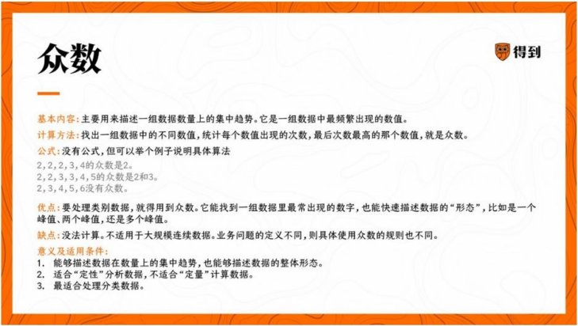
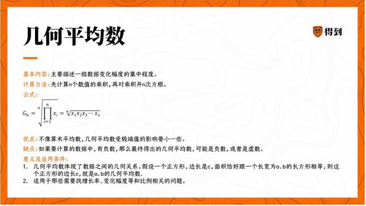

# 笔记

## 统计的思想

真实的挑战

“数人头”

```txt
当整体在一段时间中不发生数量变化的时候，某个时间点的数字就代表了整体的数字。
你可以理解成这是基于时间的抽样。
```

每次人口普查的标准时点是11月1日零点。
为什么选11月，和孩子数人头要集中一样，这个事件，全国的人口流动是最低的。

控制流动，限制变化，都是为了数的尽可能准。

统计解决这个问题可以靠抽样，通过简单随机样本，尽可能让样本对总体有代表性。

“回应误差”。
统计学可以通过分层抽样，适当对误差进行修正。

统计学当然是以数字为基础的，但它想解决的问题不是一个抽象的数学问题，面对的不是枯燥的公式，而是人们真实的生活。

三大类：

- 从数据中提取信息 - 表征
- 从数据中萃取价值 - 比较
- 从数据中获得未知 - 推测

## 表征数据

集中趋势：平均数

- 算数平均数: 数据大小上的集中局势。

- 中位数： 数据位置上的集中趋势

- 众数：一般就是所有数据中出现次数最多的八个数字，或者区间。数量上的集中趋势。

- 几何平均数： 数据变化幅度的趋势。


一个问题用什么平均数，不是由统计学决定的，而是由问题决定的。

## 理解平均数背后的意义

算法不同，其背后的现实意义就不同。
遇到更复杂的问题，我们也可以升级平均数算法，比如，给数字加权。

容易受极端值的影响，是算数平均值的弱点。

```txt
看到任何模型，都要问两个问题：
第一，模型解决的是我想解决的问题吗？
第二，模型的假设条件究竟是什么？也就是模型什么情况下成立？
```
